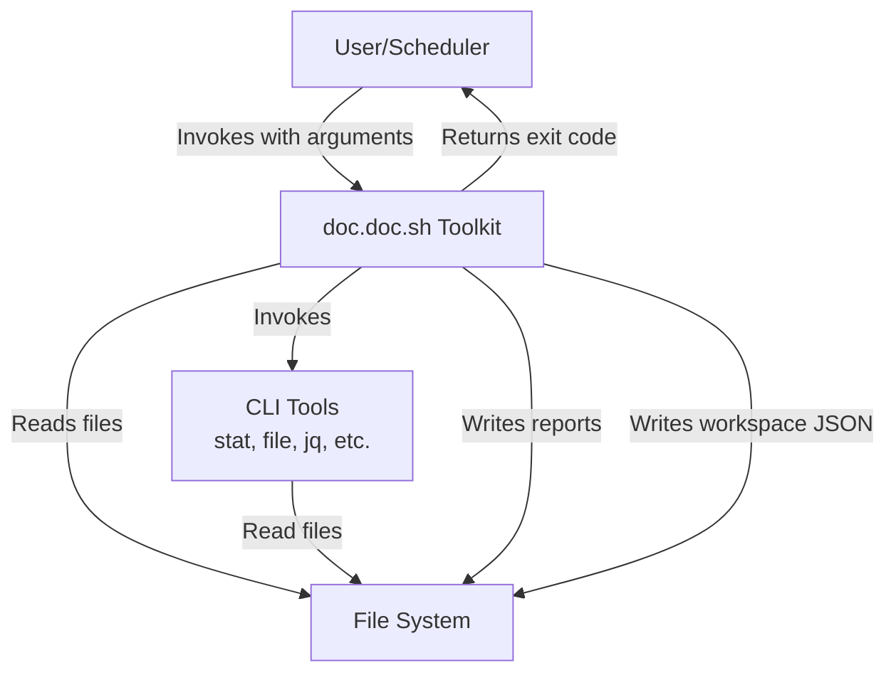
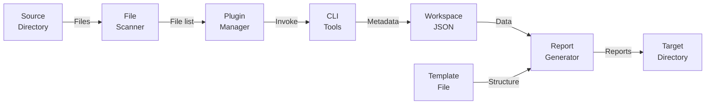
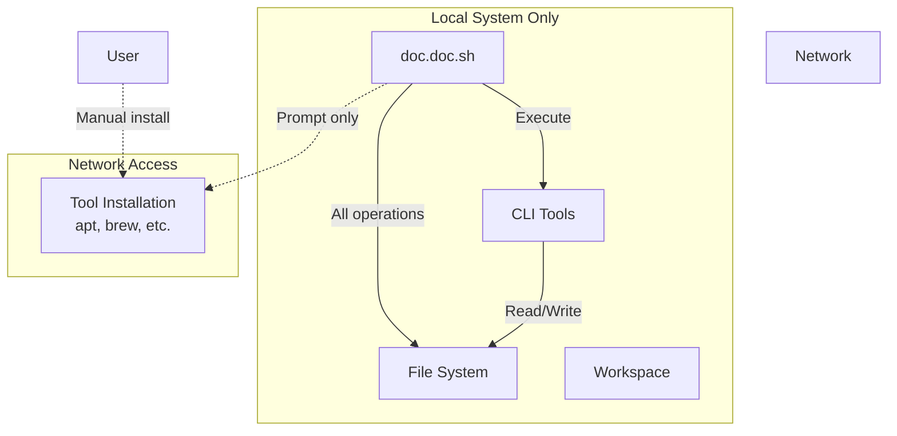

# 3. System Scope and Context

## 3.1 Business Context

The doc.doc toolkit operates as a standalone command-line utility for local metadata extraction and report generation. It serves as an orchestrator that coordinates existing CLI tools to analyze files and produce structured documentation.



### External Entities and Interfaces

| Entity | Input | Output | Purpose |
|--------|-------|--------|---------|
| **User/Scheduler** | Command invocation with arguments | Exit codes, stdout/stderr messages | Initiates analysis, receives results and status |
| **File System** | Source directory files | Markdown reports, workspace JSON | Provides input files, receives generated documentation |
| **CLI Tools** | File paths, tool-specific arguments | Structured data (text, JSON) | Perform specialized analysis tasks |
| **Workspace** | Previous scan state (JSON) | Updated scan state (JSON) | Enables incremental analysis and state persistence |

### Interface Details

**CLI Interface** (User → doc.doc.sh):
```bash
./doc.doc.sh -d <directory> -m <template> -t <target> -w <workspace> [OPTIONS]

Options:
  -d <dir>     Source directory to analyze
  -m <file>    Markdown template file
  -t <dir>     Target directory for reports
  -w <dir>     Workspace directory for state
  -v           Verbose logging
  -p list      List available plugins
  -f <format>  Output format (default: markdown)
  -h           Show help
```

**File System Interface**:
- **Reads**: Source files, template files, plugin descriptors
- **Writes**: Markdown reports, JSON workspace files, log files
- **Format**: Standard POSIX file operations

**CLI Tool Interface**:
- **Invocation**: Shell command execution via bash
- **Input**: Command-line arguments, file paths via stdin/args
- **Output**: Text/JSON to stdout, errors to stderr, exit codes
- **Examples**: `stat`, `file`, `jq`, `wc`, user-defined tools

**Workspace Interface**:
- **Format**: JSON files per analyzed document
- **Schema**: Structured metadata with timestamps, content, analysis results
- **Purpose**: State persistence, incremental updates, downstream integration

## 3.2 Technical Context

### Technology Environment

```mermaid
graph LR
    subgraph "Execution Environment"
        Bash[Bash Shell<br/>v4.0+]
        POSIX[POSIX Utilities<br/>GNU Coreutils]
    end
    
    subgraph "Required Tools"
        Stat[stat]
        File[file]
        Find[find]
    end
    
    subgraph "Optional Tools"
        JQ[jq]
        Custom[User Plugins]
    end
    
    DocDoc[doc.doc.sh]
    
    DocDoc --> Bash
    Bash --> POSIX
    DocDoc --> Required Tools
    DocDoc -.->|Optional| Optional Tools
```

### Runtime Dependencies

**Core Requirements**:
- Bash shell (v4.0 or later) with process substitution support
- POSIX-compliant utilities (find, sed, grep, etc.)
- File system with read/write access

**Standard Tools** (installed on most systems):
- `stat` - File metadata extraction
- `file` - MIME type detection
- `find` - Directory traversal
- `mkdir`, `cp`, `mv` - File operations

**Optional Tools** (plugin-specific):
- `jq` - JSON parsing and manipulation
- Platform-specific tools (defined by active plugins)
- User-provided custom tools

**No Runtime Dependencies**:
- No databases (SQLite, MySQL, etc.)
- No web servers or network services
- No language runtimes (Python, Node.js, etc.)
- No GUI frameworks or desktop dependencies

### Platform Support

**Primary Platforms**:
- Ubuntu Linux (20.04+)
- Debian-based distributions
- Generic POSIX-compliant Unix systems

**Tested Environments**:
- NAS devices (Synology, QNAP)
- Small Linux systems (Raspberry Pi)
- WSL (Windows Subsystem for Linux)
- macOS with Homebrew GNU utilities

**Platform-Specific Behavior**:
- Plugin discovery adapts to OS (`plugins/ubuntu/`, `plugins/all/`)
- Tool availability checked per platform
- File path conventions follow platform standards

### Data Flow



**Data Flow Description**:
1. **Input**: User specifies source directory, template, and workspace
2. **Discovery**: File scanner recursively traverses source directory
3. **Analysis**: Plugin manager orchestrates CLI tools based on file types
4. **Storage**: Metadata and results written to workspace as JSON
5. **Reporting**: Report generator merges data with template
6. **Output**: Markdown reports written to target directory

### External File Formats

| Format | Usage | Tools | Direction |
|--------|-------|-------|-----------|
| **Markdown** | Templates, reports | Template engine | Input & Output |
| **JSON** | Workspace data, plugin descriptors | jq, bash | Input & Output |
| **Text** | Log files, tool output | cat, grep | Output |
| **Binary** | Source files being analyzed | file, stat | Input |

### Network Isolation



**Network Policy**:
- **Runtime**: Zero network access, all processing local
- **Installation**: Network required for tool downloads only
- **User Control**: System prompts but never auto-installs
- **Security**: No data transmission to external services

## 3.3 System Boundaries

### In Scope
- ✅ CLI-based file analysis orchestration
- ✅ Metadata extraction via existing tools
- ✅ Markdown report generation
- ✅ Plugin-based extensibility
- ✅ Data-driven workflow automation
- ✅ Local workspace state management
- ✅ Incremental analysis support
- ✅ Error handling and tool verification

### Out of Scope
- ❌ Graphical user interface
- ❌ Web-based dashboard or API
- ❌ Database management system
- ❌ Cloud/online processing
- ❌ Built-in content analysis (delegates to tools)
- ❌ Tool implementation (uses existing tools)
- ❌ Automatic tool installation (prompts only)
- ❌ Multi-user concurrent access
- ❌ Real-time monitoring or watching

### Interface Contracts

**Command-Line Contract**:
- POSIX-compliant argument parsing
- Standard exit codes (0=success, non-zero=error)
- Help text via `-h` flag
- Version info available
- Consistent error messaging

**Workspace Contract**:
- JSON format with defined schema
- Atomic file operations (via temp + rename)
- Lock files for concurrent safety
- Timestamp-based incremental detection
- Backward-compatible schema evolution

**Plugin Contract**:
- Descriptor.json with required fields
- Standard invocation pattern
- Consumes/provides data declarations
- Exit codes indicate success/failure
- Output to stdout, errors to stderr
