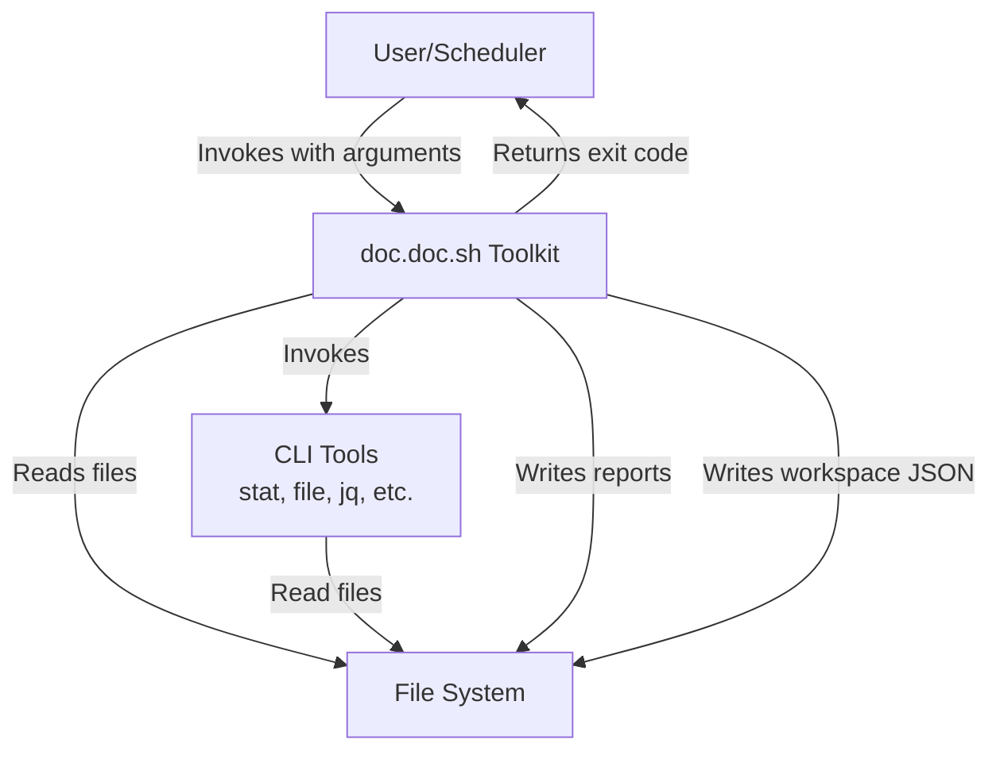
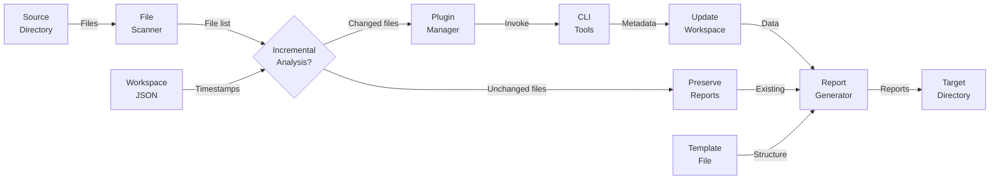
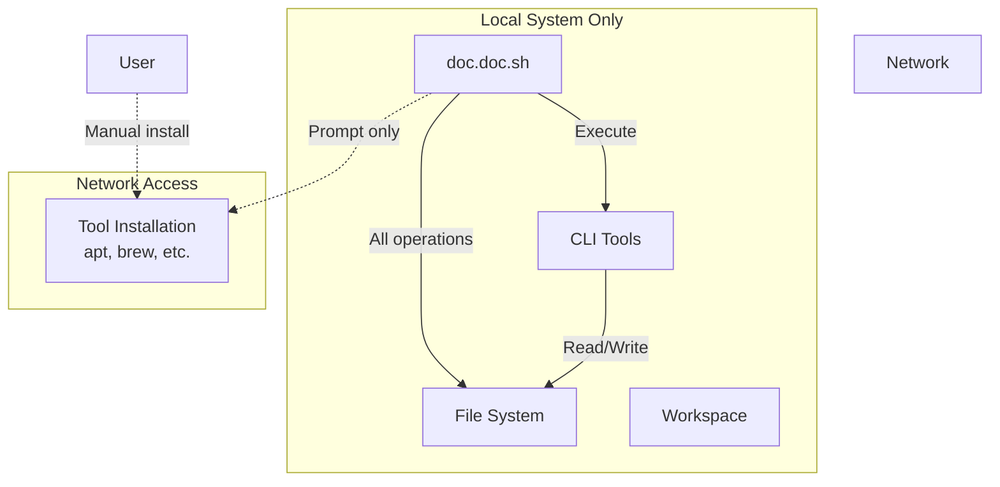

# 3. System Scope and Context

## Table of Contents

- [3.1 Business Context](#31-business-context)
  - [External Entities and Interfaces](#external-entities-and-interfaces)
  - [Interface Details](#interface-details)
- [3.2 Technical Context](#32-technical-context)
  - [Technology Stack](#technology-stack)
  - [Dependencies](#dependencies)
  - [Platform Support](#platform-support)
  - [Data Flow](#data-flow)
- [3.3 Use Cases](#33-use-cases)

## 3.1 Business Context

The doc.doc toolkit operates as a standalone command-line utility for local metadata extraction and report generation. It serves as an orchestrator that coordinates existing CLI tools to analyze files and produce structured documentation.



### External Entities and Interfaces

| Entity | Input | Output | Purpose |
|--------|-------|--------|---------|
| **User/Scheduler** | Command invocation with arguments | Exit codes, stdout/stderr messages | Initiates analysis, receives results and status |
| **File System** | Source directory files | Markdown reports, workspace JSON | Provides input files, receives generated documentation |
| **CLI Tools** | File paths, tool-specific arguments | Structured data (text, JSON) | Perform specialized analysis tasks |
| **Workspace** | Previous scan state (JSON) | Updated scan state (JSON) | Enables incremental analysis and state persistence |

### Interface Details

**CLI Interface** (User → doc.doc.sh):
```bash
./doc.doc.sh -d <directory> -m <template> -t <target> -w <workspace> [OPTIONS]

Options:
  -d <dir>     Source directory to analyze (required)
  -m <file>    Markdown template file (required)
  -t <dir>     Target directory for reports (required)
  -w <dir>     Workspace directory for state (required)
  -h, --help   Display usage information and exit
  -v, --verbose Enable verbose logging mode
  -p list      List available plugins with descriptions and status
  -f fullscan  Force full re-analysis of all files (default: incremental)
```

**File System Interface**:
- **Reads**: Source files, template files, plugin descriptors
- **Writes**: Markdown reports, JSON workspace files, log files
- **Format**: Standard POSIX file operations

**CLI Tool Interface**:
- **Invocation**: Shell command execution via bash
- **Input**: Command-line arguments, file paths via stdin/args
- **Output**: Text/JSON to stdout, errors to stderr, exit codes
- **Examples**: `stat`, `file`, `jq`, `wc`, user-defined tools

**Workspace Interface**:
- **Format**: JSON files containing file metadata, timestamps, and analysis state
- **Schema**: Structured metadata with last-analyzed timestamps, file modification times, checksums, analysis results
- **Purpose**: State persistence for incremental analysis, tracking file changes between runs, downstream integration
- **Incremental Analysis**: Stores last-scan timestamps to detect file modifications and skip unchanged files by default

### Key Business Use Cases

**UC1: Plugin Discovery**
- **Actor**: User/Developer
- **Trigger**: User invokes `./doc.doc.sh -p list`
- **Flow**:
  1. System discovers all plugins in plugins/ directory (platform-specific and generic)
  2. System reads descriptor.json for each plugin
  3. System extracts plugin name, description, and active status
  4. System displays formatted list sorted alphabetically
- **Output**: List showing plugin names, descriptions, and [ACTIVE]/[INACTIVE] status
- **Purpose**: Enable users to discover available functionality and verify plugin activation

**UC2: Incremental Analysis (Default Behavior)**
- **Actor**: User/Scheduler
- **Trigger**: User invokes analysis without `-f fullscan` option
- **Precondition**: Workspace exists from previous run
- **Flow**:
  1. System loads last-analyzed timestamps from workspace JSON
  2. System scans source directory for files
  3. System compares file modification times against stored timestamps
  4. System identifies changed/new files requiring re-analysis
  5. System processes only changed files through plugins
  6. System preserves reports for unchanged files
  7. System updates workspace timestamps for processed files
- **Output**: Reports for all files (regenerated for changed, preserved for unchanged)
- **Purpose**: Optimize performance by avoiding redundant analysis of unchanged files

**UC3: Force Full Re-analysis**
- **Actor**: User/Administrator
- **Trigger**: User invokes with `-f fullscan` option
- **Flow**:
  1. System ignores existing workspace timestamps
  2. System scans entire source directory
  3. System processes all files regardless of modification status
  4. System regenerates all reports
  5. System updates all workspace timestamps
- **Output**: Completely regenerated report set for full directory
- **Purpose**: Support scenarios requiring fresh analysis (after plugin updates, template changes, etc.)

**UC4: First-Time Analysis**
- **Actor**: New User
- **Trigger**: User invokes tool on new directory without existing workspace
- **Flow**:
  1. System detects missing workspace
  2. System creates workspace directory
  3. System performs full analysis (equivalent to fullscan)
  4. System creates initial timestamp metadata
  5. System generates complete report set
- **Output**: New workspace with full metadata, complete reports
- **Purpose**: Initialize analysis for new directories

## 3.2 Technical Context

### Technology Environment

```mermaid
graph LR
    subgraph "Execution Environment"
        Bash[Bash Shell<br/>v4.0+]
        POSIX[POSIX Utilities<br/>GNU Coreutils]
    end
    
    subgraph "Required Tools"
        Stat[stat]
        File[file]
        Find[find]
    end
    
    subgraph "Optional Tools"
        JQ[jq]
        Custom[User Plugins]
    end
    
    DocDoc[doc.doc.sh]
    
    DocDoc --> Bash
    Bash --> POSIX
    DocDoc --> Required Tools
    DocDoc -.->|Optional| Optional Tools
```

### Runtime Dependencies

**Core Requirements**:
- Bash shell (v4.0 or later) with process substitution support
- POSIX-compliant utilities (find, sed, grep, etc.)
- File system with read/write access for reports and workspace state

**Standard Tools** (installed on most systems):
- `stat` - File metadata extraction and modification time detection
- `file` - MIME type detection
- `find` - Directory traversal and file discovery
- `mkdir`, `cp`, `mv` - File operations
- `date` - Timestamp generation and comparison for incremental analysis

**Optional Tools** (plugin-specific):
- `jq` - JSON parsing and manipulation (workspace state, plugin descriptors)
- Platform-specific tools (defined by active plugins)
- User-provided custom tools

**No Runtime Dependencies**:
- No databases (SQLite, MySQL, etc.)
- No web servers or network services
- No language runtimes (Python, Node.js, etc.)
- No GUI frameworks or desktop dependencies

### Platform Support

**Primary Platforms**:
- Ubuntu Linux (20.04+)
- Debian-based distributions
- Generic POSIX-compliant Unix systems

**Tested Environments**:
- NAS devices (Synology, QNAP)
- Small Linux systems (Raspberry Pi)
- WSL (Windows Subsystem for Linux)
- macOS with Homebrew GNU utilities

**Platform-Specific Behavior**:
- Plugin discovery adapts to OS (`plugins/ubuntu/`, `plugins/all/`)
- Tool availability checked per platform
- File path conventions follow platform standards

### Data Flow



**Data Flow Description**:
1. **Input**: User specifies source directory, template, workspace, and options
2. **Discovery**: File scanner recursively traverses source directory
3. **Incremental Decision**: System checks workspace timestamps (unless `-f fullscan` specified)
4. **Selective Analysis**: Plugin manager orchestrates CLI tools only for changed/new files
5. **Storage**: Metadata and results written to workspace as JSON with updated timestamps
6. **Report Preservation**: Unchanged files reuse existing reports from previous run
7. **Reporting**: Report generator merges data with template (new + preserved reports)
8. **Output**: Markdown reports written to target directory

### External File Formats

| Format | Usage | Tools | Direction |
|--------|-------|-------|-----------|
| **Markdown** | Templates, reports | Template engine | Input & Output |
| **JSON** | Workspace state (timestamps, metadata), plugin descriptors | jq, bash | Input & Output |
| **Text** | Log files, tool output | cat, grep | Output |
| **Binary** | Source files being analyzed | file, stat | Input |

**Workspace JSON Schema** (for incremental analysis):
```json
{
  "last_full_scan": "2026-02-06T10:30:00Z",
  "files": {
    "path/to/file.md": {
      "last_analyzed": "2026-02-06T10:30:15Z",
      "last_modified": "2026-02-05T14:22:00Z",
      "checksum": "sha256:abc123...",
      "report_path": "output/file.doc.doc.md"
    }
  }
}
```

### Network Isolation



**Network Policy**:
- **Runtime**: Zero network access, all processing local
- **Installation**: Network required for tool downloads only
- **User Control**: System prompts but never auto-installs
- **Security**: No data transmission to external services

## 3.3 System Boundaries

### In Scope
- ✅ CLI-based file analysis orchestration
- ✅ Metadata extraction via existing tools
- ✅ Markdown report generation
- ✅ Plugin-based extensibility
- ✅ Data-driven workflow automation
- ✅ Local workspace state management
- ✅ Incremental analysis support
- ✅ Error handling and tool verification

### Out of Scope
- ❌ Graphical user interface
- ❌ Web-based dashboard or API
- ❌ Database management system
- ❌ Cloud/online processing
- ❌ Built-in content analysis (delegates to tools)
- ❌ Tool implementation (uses existing tools)
- ❌ Automatic tool installation (prompts only)
- ❌ Multi-user concurrent access
- ❌ Real-time monitoring or watching

### Interface Contracts

**Command-Line Contract**:
- POSIX-compliant argument parsing
- Standard exit codes (0=success, non-zero=error)
- Help text via `-h` flag
- Version info available
- Consistent error messaging

**Workspace Contract**:
- JSON format with defined schema
- Atomic file operations (via temp + rename)
- Lock files for concurrent safety
- Timestamp-based incremental detection
- Backward-compatible schema evolution

**Plugin Contract**:
- Descriptor.json with required fields
- Standard invocation pattern
- Consumes/provides data declarations
- Exit codes indicate success/failure
- Output to stdout, errors to stderr
