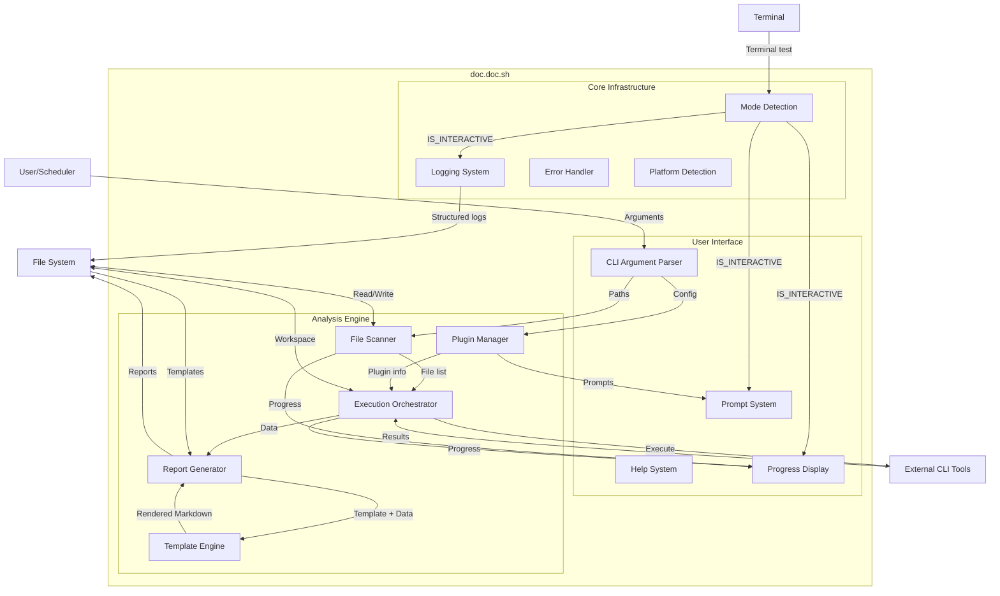
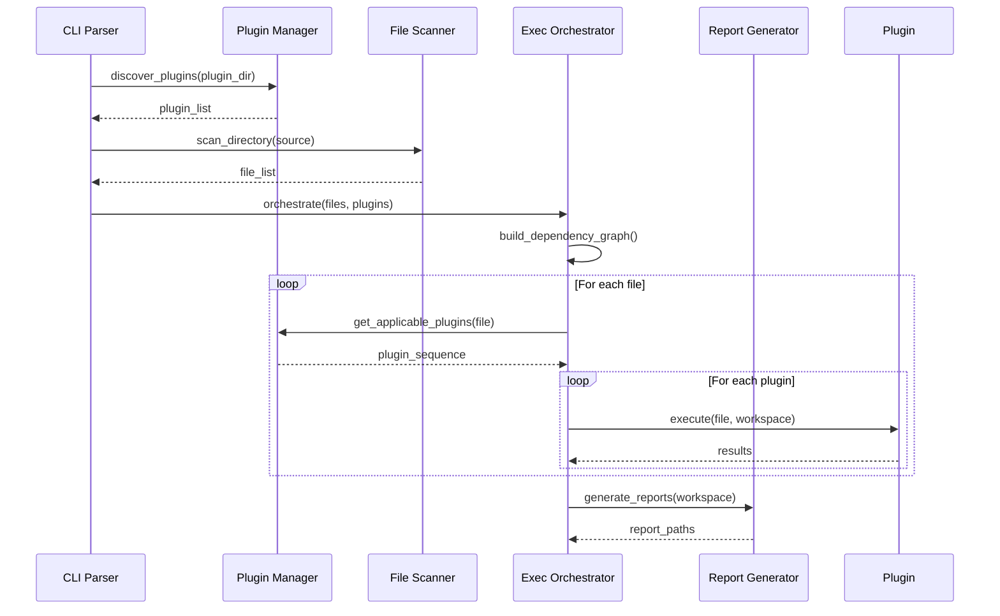
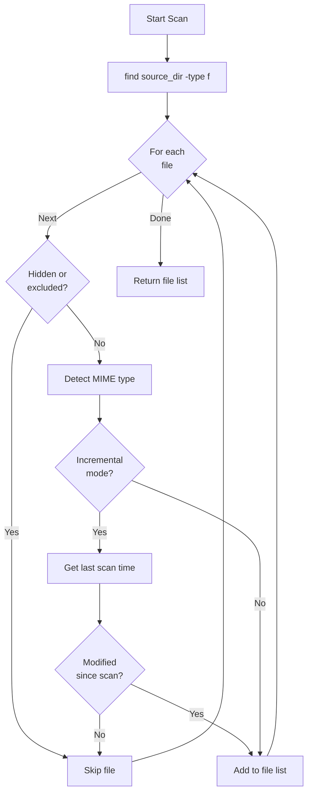
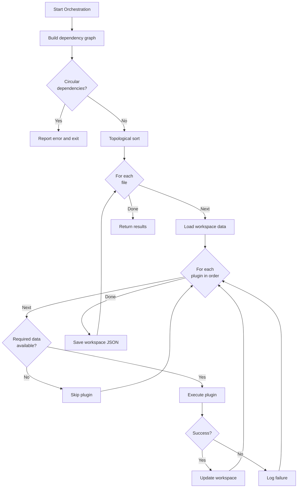
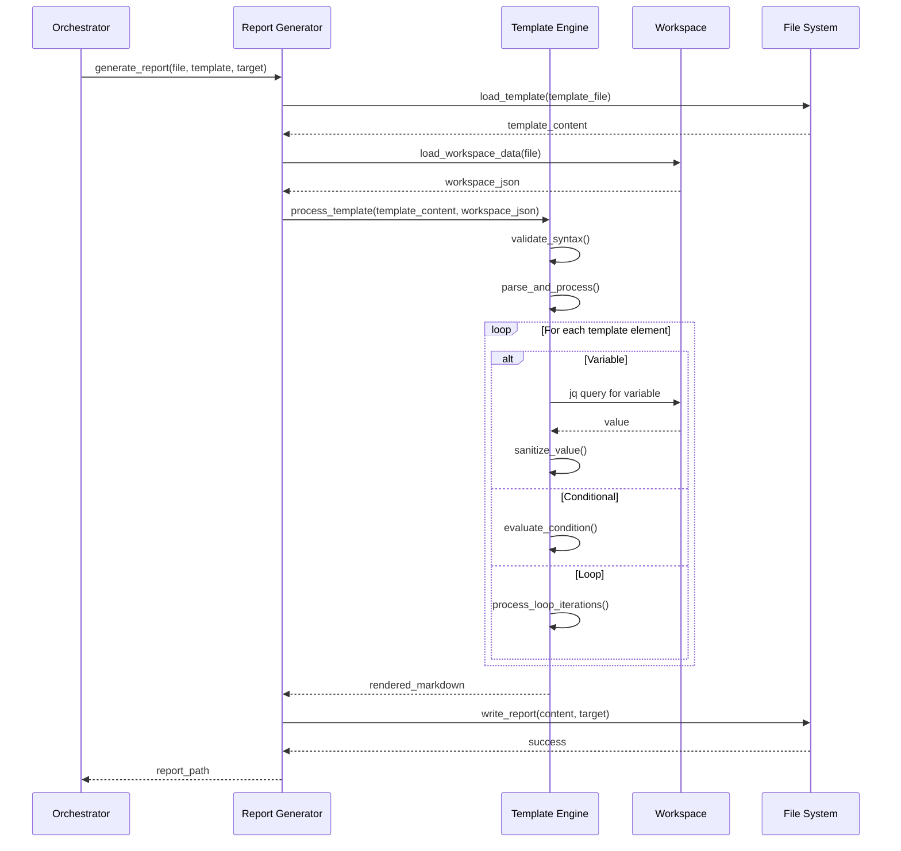
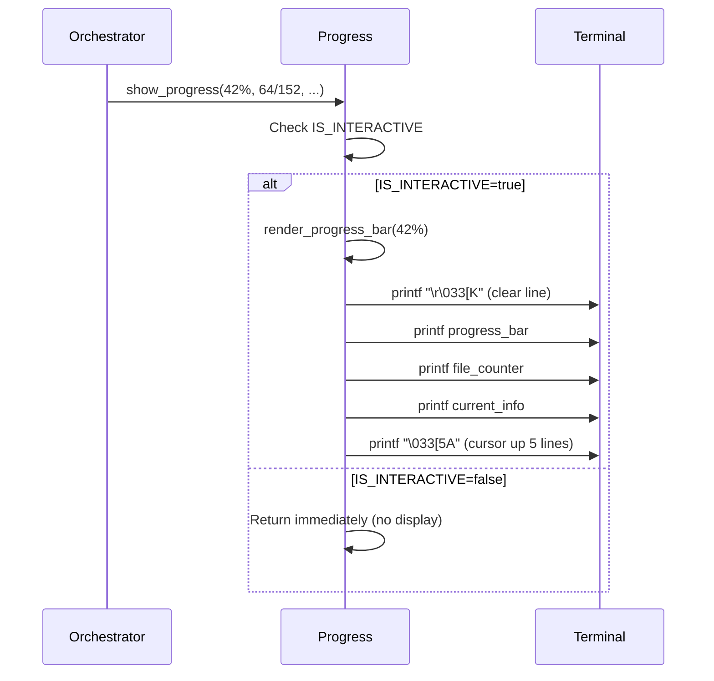
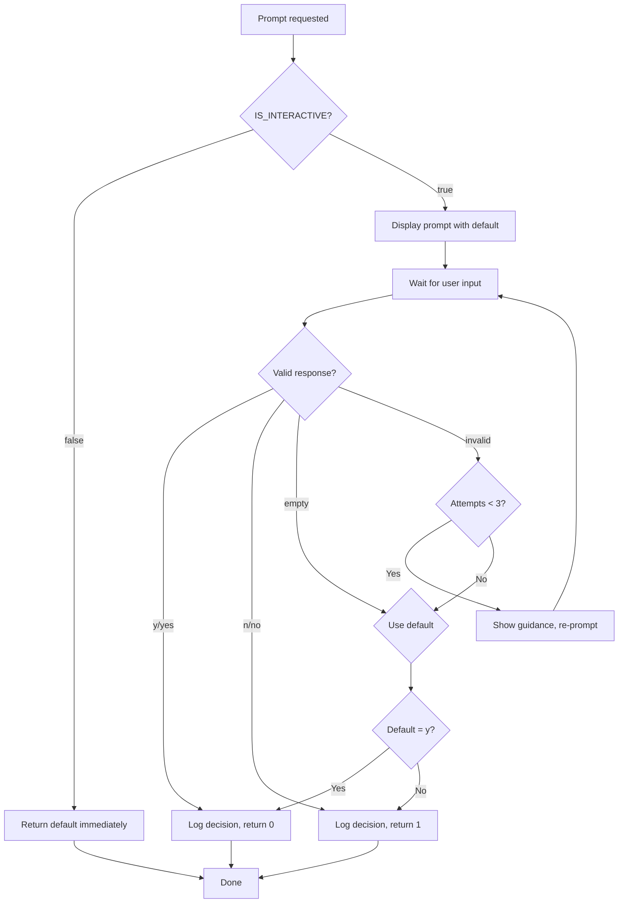

# 5. Building Block View

## Table of Contents

- [5.1 Whitebox Overall System](#51-whitebox-overall-system)
- [5.2 CLI Argument Parser](#52-cli-argument-parser)
- [5.3 Plugin Manager](#53-plugin-manager)
- [5.4 File Scanner](#54-file-scanner)
- [5.5 Execution Orchestrator](#55-execution-orchestrator)
- [5.6 Report Generator](#56-report-generator)
- [5.7 Error Handling Module](#57-error-handling-module)
- [5.8 Workspace Manager](#58-workspace-manager)

## 5.1 Whitebox Overall System

The doc.doc toolkit consists of major building blocks organized into functional layers that orchestrate file analysis and report generation through a plugin-based, mode-aware architecture.



### Contained Building Blocks

#### Core Infrastructure Layer

| Component | Responsibility | Key Interfaces |
|-----------|---------------|----------------|
| **Mode Detection** | Detect interactive vs. non-interactive execution context | `detect_interactive_mode()`, `IS_INTERACTIVE` global |
| **Logging System** | Provide mode-aware structured logging with timestamps | `log()`, `set_log_level()`, `is_verbose()` |
| **Error Handler** | Centralized error management and exit code handling | `error_exit()`, `handle_error()` |
| **Platform Detection** | Identify operating system and platform-specific paths | `detect_platform()`, `PLATFORM` global |

#### User Interface Layer

| Component | Responsibility | Key Interfaces |
|-----------|---------------|----------------|
| **CLI Argument Parser** | Parse command-line arguments, validate inputs, show help | `parse_arguments()`, `validate_config()`, `show_help()` |
| **Help System** | Display usage information and documentation | `show_help()`, `show_version()`, `show_examples()` |
| **Progress Display** | Show live progress bars and status (interactive mode only) | `show_progress()`, `clear_progress()`, `render_progress_bar()` |
| **Prompt System** | Interactive user confirmations and decisions | `prompt_yes_no()`, `prompt_tool_installation()` |

#### Analysis Engine Layer

| Component | Responsibility | Key Interfaces |
|-----------|---------------|----------------|
| **Plugin Manager** | Discover plugins, load descriptors, validate capabilities | `discover_plugins()`, `load_descriptor()`, `check_tool_availability()` |
| **File Scanner** | Traverse directories, detect file types, filter files | `scan_directory()`, `detect_mime_type()`, `filter_by_type()` |
| **Execution Orchestrator** | Build dependency graph, schedule plugins, manage workspace | `build_dependency_graph()`, `execute_plugin()`, `update_workspace()` |
| **Template Engine** | Process templates with variables, conditionals, loops | `process_template()`, `validate_syntax()`, `sanitize_value()` |
| **Report Generator** | Load templates, merge data, render Markdown, generate aggregated reports | `generate_report()`, `generate_aggregated_report()`, `write_report()` |

### Important Interfaces



## 5.2 Level 1: CLI Argument Parser

### Purpose
Handles all command-line interaction, validates user inputs, and establishes runtime configuration.

### Responsibilities
- Parse POSIX-style command-line arguments
- Validate required arguments and paths
- Display help and usage information
- Set up logging verbosity
- Handle special commands (`-p list`, `--version`)

### Interface

**Input**:
```bash
Arguments: $@  # Command-line arguments array
Environment: PATH, HOME  # Shell environment variables
```

**Output**:
```bash
CONFIG associative array:
  SOURCE_DIR
  TEMPLATE_FILE
  TARGET_DIR
  WORKSPACE_DIR
  VERBOSE
  COMMAND (list|analyze)
```

**Functions**:
- `parse_arguments()` - Main argument parsing logic
- `show_help()` - Display usage information
- `show_version()` - Display version information
- `validate_paths()` - Check directory/file existence
- `set_defaults()` - Apply default configuration values

### Error Handling
- Missing required arguments → show help, exit 1
- Invalid paths → clear error message, exit 1
- Unknown flags → show help, exit 1
- Conflicting options → clear error message, exit 1

## 5.3 Level 1: Plugin Manager

### Purpose
Manages the plugin lifecycle including discovery, loading, validation, and tool availability checking.

### Responsibilities
- Discover plugins from platform-specific directories
- Parse and validate `descriptor.json` files
- Verify CLI tool availability for active plugins
- Provide plugin metadata to orchestrator
- Handle plugin list display (`-p list` command)

### Interface

**Input**:
```bash
PLUGIN_DIR      # Base plugin directory path
PLATFORM        # Detected OS (ubuntu, all, etc.)
```

**Output**:
```bash
PLUGINS array of:
  name
  description
  active (boolean)
  processes (mime_types, file_extensions)
  consumes (data requirements)
  provides (data outputs)
  execute_commandline
  install_commandline
  check_commandline
  tool_available (boolean)
```

**Functions**:
- `discover_plugins(plugin_dir, platform)` - Find all plugin descriptors
- `load_plugin_descriptor(desc_file)` - Parse JSON and extract metadata
- `validate_descriptor(plugin)` - Check required fields present
- `check_tool_availability(plugin)` - Execute check_commandline
- `list_plugins()` - Format and display plugin list
- `get_plugins_for_file(file_path, mime_type)` - Filter applicable plugins

### Plugin Discovery Algorithm

```mermaid
flowchart TD
    Start[Start Discovery] --> DetectOS[Detect Platform]
    DetectOS --> ScanAll[Scan plugins/all/]
    ScanAll --> ScanPlatform[Scan plugins/{platform}/]
    ScanPlatform --> FindDesc[Find descriptor.json files]
    FindDesc --> Loop{For each<br/>descriptor}
    Loop -->|Next| LoadDesc[Load JSON]
    LoadDesc --> Validate{Valid?}
    Validate -->|Yes| CheckTool[Check tool availability]
    Validate -->|No| LogError[Log validation error]
    CheckTool --> AddPlugin[Add to plugin list]
    LogError --> Loop
    AddPlugin --> Loop
    Loop -->|Done| Return[Return plugin list]
```

### Data Structures

**Plugin Descriptor Schema**:
```json
{
  "name": "string (required)",
  "description": "string (required)",
  "active": "boolean (default: false)",
  "processes": {
    "mime_types": ["string"],
    "file_extensions": ["string"]
  },
  "consumes": {
    "param_name": {
      "type": "string",
      "description": "string"
    }
  },
  "provides": {
    "param_name": {
      "type": "string",
      "description": "string"
    }
  },
  "execute_commandline": "string (required)",
  "install_commandline": "string (required)",
  "check_commandline": "string (required)"
}
```

## 5.4 Level 1: File Scanner

### Purpose
Recursively traverses source directory, identifies files, determines types, and builds file inventory.

### Responsibilities
- Recursive directory traversal
- File type detection (MIME type, extension)
- Filter hidden files and system directories
- Build list of files for analysis
- Detect changes since last scan (incremental analysis)

### Interface

**Input**:
```bash
SOURCE_DIR          # Root directory to scan
WORKSPACE_DIR       # For incremental detection
INCREMENTAL         # Boolean flag
```

**Output**:
```bash
FILE_LIST array of:
  file_path_absolute
  file_path_relative
  mime_type
  file_extension
  last_modified_timestamp
  file_size
  needs_analysis (boolean)
```

**Functions**:
- `scan_directory(source_dir)` - Main scanning entry point
- `detect_mime_type(file_path)` - Use `file` command
- `get_last_scan_time(file_path, workspace)` - Check workspace
- `is_file_modified(file_path, last_scan)` - Compare timestamps
- `filter_hidden_files(file_list)` - Apply exclusion rules

### Scanning Strategy



### Exclusion Rules
- Hidden files (starting with `.`) - excluded by default
- System directories (`.git/`, `node_modules/`, etc.) - excluded
- Symbolic links - followed with depth limit
- Permission denied - logged but not fatal

## 5.5 Level 1: Execution Orchestrator

### Purpose
Coordinates plugin execution using data-driven dependency resolution, manages workspace state, and ensures correct execution order.

### Responsibilities
- Build plugin dependency graph from consumes/provides
- Determine execution order automatically
- Execute plugins in data-dependency order
- Manage workspace JSON files
- Handle plugin failures gracefully
- Support incremental execution

### Interface

**Input**:
```bash
FILE_LIST           # Files to analyze
PLUGINS             # Available plugins
WORKSPACE_DIR       # State persistence location
```

**Output**:
```bash
WORKSPACE_FILES     # Updated JSON files per analyzed file
EXIT_CODE           # Overall success/failure
EXECUTION_LOG       # Plugin execution trace
```

**Functions**:
- `build_dependency_graph(plugins)` - Analyze consumes/provides
- `topological_sort(graph)` - Determine execution order
- `detect_circular_dependencies(graph)` - Validate graph
- `execute_plugin_sequence(file, plugins)` - Run plugins for one file
- `execute_plugin(plugin, file, workspace)` - Single plugin execution
- `load_workspace_data(file, workspace)` - Read existing JSON
- `update_workspace_data(file, data, workspace)` - Atomic write
- `lock_workspace_file(file)` - Concurrent access prevention

### Dependency Graph Algorithm



### Workspace Data Structure

**Workspace File**: `workspace/<file_hash>.json`
```json
{
  "file_path": "path/to/file.ext",
  "file_type": "application/pdf",
  "last_scanned": "2026-02-06T10:00:00Z",
  "file_size": 1234567,
  "file_last_modified": "2026-02-05T15:30:00Z",
  "file_owner": "user",
  "content": {
    "text": "extracted text content...",
    "word_count": 5432,
    "summary": "Document about...",
    "tags": ["keyword1", "keyword2"]
  },
  "plugins_executed": [
    {"name": "stat", "timestamp": "2026-02-06T10:00:01Z", "status": "success"},
    {"name": "ocrmypdf", "timestamp": "2026-02-06T10:00:05Z", "status": "success"}
  ]
}
```

**Lock File**: `workspace/<file_hash>.json.lock`
- Created before write, deleted after
- Contains PID and timestamp
- Prevents concurrent modifications

### Plugin Execution Pattern

```bash
# 1. Change to plugin directory
cd "${PLUGIN_DIR}/${plugin_name}"

# 2. Set up environment with workspace data
export file_path_absolute="${FILE_PATH}"
# ... export other available data ...

# 3. Execute plugin command
eval "${plugin_execute_commandline}"

# 4. Capture new data from exported variables
# Plugin sets: file_owner, file_size, etc.

# 5. Update workspace with new data
```

## 5.6 Level 1: Report Generator

### Purpose
Transforms workspace data into human-readable Markdown reports using customizable templates with conditionals, loops, and variable substitution.

### Responsibilities
- Load and validate template files (delegates to Template Engine)
- Process templates with conditionals and loops (via Template Engine)
- Generate per-file Markdown reports
- Generate aggregated summary reports (opt-in with --summary flag)
- Apply consistent formatting
- Handle missing data gracefully via template conditionals

### Interface

**Input**:
```bash
TEMPLATE_FILE       # Markdown template with placeholders
WORKSPACE_DATA      # JSON data for substitution
TARGET_DIR          # Destination for reports
```

**Output**:
```bash
REPORT_FILES        # Generated Markdown files
```

**Functions**:
- `load_template(template_file)` - Read and cache template content
- `generate_report(file, workspace, template, target)` - Main per-file generation
- `generate_aggregated_report(target, stats, file_list)` - Aggregated summary (opt-in)
- `write_report(content, target_path)` - Atomic write to file system
- `collect_statistics(workspace_files)` - Gather corpus-level statistics
- `process_template(template, data)` - Delegate to Template Engine component

### Sub-Component: Template Engine

The Report Generator uses the **Template Engine** component (see [08_0011 Template Engine Concept](../08_concepts/08_0011_template_engine.md)) to process templates.

**Template Engine Capabilities** (per [ADR-0011](../09_architecture_decisions/ADR_0011_bash_template_engine_with_control_structures.md)):
- Variable substitution: `{{variable}}`, `{{nested.field}}`
- Conditionals: `{{#if var}}...{{else}}...{{/if}}`
- Loops: `{{#each array}}{{this}}{{@index}}{{/each}}`
- Comments: `{{! documentation comment}}`
- Security controls: No code execution, sanitization, iteration limits, timeout

**Template Engine Interface**:
```bash
process_template(template_file, workspace_json) → markdown_output
  Returns: Generated markdown (stdout)
  Exit Codes: 0 (success), 1 (syntax error), 2 (timeout), 3 (security violation)
```

**Template Syntax Examples**:

**Variable Substitution**:
```markdown
# Analysis Report: {{filename}}
**Path**: {{file_path_relative}}
**Size**: {{file_size_human}}
```

**Conditionals**:
```markdown
{{#if content.summary}}
## Summary
{{content.summary}}
{{else}}
*No summary available*
{{/if}}
```

**Loops**:
```markdown
{{#if content.tags}}
## Tags
{{#each content.tags}}
- {{this}}
{{/each}}
{{else}}
*No tags assigned*
{{/if}}
```

**Processing Algorithm** (Template Engine):
1. Validate template syntax (balanced tags, allowed constructs)
2. Parse template with state machine (TEXT, IN_CONDITIONAL, IN_LOOP states)
3. Resolve variables via jq queries to workspace JSON
4. Evaluate conditionals (truthy/falsy checks)
5. Process loops with iteration limits
6. Sanitize all variable values
7. Remove comments
8. Generate final output with timeout enforcement

### Report Generation Flow



### Error Handling
- Template not found → use default template or error
- Template syntax error → abort with clear error message and line number
- Template security violation → abort processing, log security event
- Template timeout → abort processing (30s default)
- Variable missing → substitute with empty string (silent, handled in template conditionals)
- Invalid workspace JSON → abort with parsing error
- Write failure → log error, continue with other files
- Aggregated report generation failure → log error, per-file reports still succeed

### Security

Template processing enforces strict security controls per [req_0049](../../../01_vision/02_requirements/03_accepted/req_0049_template_injection_prevention.md):

- **No Code Execution**: Templates cannot execute shell commands (no eval, command substitution)
- **Variable Sanitization**: All values escaped (shell metacharacters, Markdown formatting)
- **Iteration Limits**: Maximum 10,000 iterations per template
- **Nesting Limits**: Maximum 5 nesting levels for conditionals/loops
- **Timeout Enforcement**: 30-second processing timeout
- **Syntax Validation**: Templates validated before processing, reject malformed templates

See [Security Scope: Template Processing](../../../01_vision/04_security/02_scopes/04_template_processing_security.md) for comprehensive threat model.

### Architecture Decision

The Report Generator's template processing capabilities are defined in [ADR-0011: Bash Template Engine with Control Structures](../09_architecture_decisions/ADR_0011_bash_template_engine_with_control_structures.md), which supersedes the original simple substitution approach from [ADR-0005](../09_architecture_decisions/ADR_0005_template_based_report_generation.md).

## 5.7 Level 1: Mode Detection

### Purpose
Determines execution context (interactive vs. non-interactive) early in initialization to enable mode-aware behavioral adaptation throughout the system.

### Responsibilities
- Detect terminal attachment using POSIX tests (`-t 0` and `-t 1`)
- Support environment variable override (`DOC_DOC_INTERACTIVE`)
- Store detection result in global `IS_INTERACTIVE` variable
- Log detected mode for debugging
- Enable all other components to adapt behavior based on context

### Interface

**Input**:
```bash
stdin (file descriptor 0)    # Terminal test: [ -t 0 ]
stdout (file descriptor 1)   # Terminal test: [ -t 1 ]
DOC_DOC_INTERACTIVE          # Optional environment variable override
```

**Output**:
```bash
IS_INTERACTIVE               # Global boolean: true/false
```

**Functions**:
- `detect_interactive_mode()` - Main detection logic with override support

### Detection Algorithm

```mermaid
flowchart TD
    Start[Start Detection] --> CheckEnv{DOC_DOC_INTERACTIVE<br/>set?}
    CheckEnv -->|Yes| UseEnv[Use environment value]
    CheckEnv -->|No| TestStdin[Test stdin: [ -t 0 ]]
    TestStdin --> StdinResult{Is terminal?}
    StdinResult -->|No| NonInteractive[IS_INTERACTIVE=false]
    StdinResult -->|Yes| TestStdout[Test stdout: [ -t 1 ]]
    TestStdout --> StdoutResult{Is terminal?}
    StdoutResult -->|No| NonInteractive
    StdoutResult -->|Yes| Interactive[IS_INTERACTIVE=true]
    UseEnv --> Interactive
    Interactive --> LogMode[Log: Interactive mode]
    NonInteractive --> LogMode2[Log: Non-interactive mode]
    LogMode --> Export[Export IS_INTERACTIVE]
    LogMode2 --> Export
    Export --> Done[Detection complete]
```

### Mode Classification Examples

| Execution Context | stdin | stdout | Mode | Rationale |
|------------------|-------|--------|------|-----------|
| `./doc.doc.sh` | Terminal | Terminal | Interactive | User present at terminal |
| `./doc.doc.sh > log.txt` | Terminal | File | Non-Interactive | Output redirected, user can't see |
| `echo \| ./doc.doc.sh` | Pipe | Terminal | Non-Interactive | Input piped, can't read user response |
| `./doc.doc.sh &` | None | None | Non-Interactive | Background process |
| `cron: ./doc.doc.sh` | None | None | Non-Interactive | Scheduled task |
| `ssh host "./doc.doc.sh"` | Pseudo-TTY | Pseudo-TTY | Interactive | SSH with PTY allocation |

### Integration Points
- **Logging Component**: Adapts log format based on `IS_INTERACTIVE`
- **Progress Display**: Only activates when `IS_INTERACTIVE=true`
- **Prompt System**: Only prompts when `IS_INTERACTIVE=true`
- **Plugin Manager**: Tool installation decisions based on mode
- **Error Handler**: Error message format adapts to mode

### Error Handling
- Detection failure → default to non-interactive (fail-safe)
- Invalid environment variable value → log warning, use auto-detection
- Terminal test failure → assume non-interactive

## 5.8 Level 1: Progress Display

### Purpose
Provides live, in-place progress feedback during long-running operations in interactive mode only.

### Responsibilities
- Render 40-character progress bar with centered percentage
- Display file counters (processed, skipped, total)
- Show current file being processed and executing plugin
- Update display in place using ANSI escape codes
- Suppress entirely in non-interactive mode
- Clean up display on completion

### Interface

**Input**:
```bash
IS_INTERACTIVE          # Mode detection result
percent                 # Progress percentage (0-100)
processed               # Files processed count
total                   # Total files count
skipped                 # Files skipped count
current_file            # Currently processing file path
current_plugin          # Currently executing plugin name
```

**Output**:
```bash
# Terminal display (in-place update)
Progress: ████████████████░░░░░░░░░░░░░░░░░░░░░░░░ 42%
Files processed: 64/152
Files skipped: 3
Processing: documents/reports/quarterly_review_2025.pdf
Executing plugin: ocrmypdf
```

**Functions**:
- `show_progress(percent, processed, total, skipped, file, plugin)` - Update display
- `render_progress_bar(percent)` - Generate progress bar string
- `clear_progress()` - Clear display on completion
- `get_terminal_width()` - Detect terminal width for path truncation
- `truncate_path(path, max_width)` - Shorten file paths to fit

### Progress Bar Rendering

```bash
# 40-character bar with centered percentage
# Filled: ████████████████ (16 chars = 40%)
# Empty:  ░░░░░░░░░░░░░░░░░░░░░░░░ (24 chars = 60%)
# Result: ████████████████ 40% ░░░░░░░░░░░░░░░░░░░░░░░░

filled_width = (percent * 40) / 100
empty_width = 40 - filled_width
```

### Display Update Strategy



### ANSI Escape Codes Used
- `\r` - Carriage return (move cursor to line start)
- `\033[K` - Clear line from cursor to end
- `\033[nA` - Move cursor up n lines
- `\033[nB` - Move cursor down n lines

### Terminal Compatibility
- Requires ANSI escape code support (most modern terminals)
- Graceful degradation: progress suppressed if terminal width unavailable
- Tested on: bash, zsh, xterm, gnome-terminal, iTerm2, tmux, screen

## 5.9 Level 1: Prompt System

### Purpose
Enables interactive users to make decisions about optional operations through yes/no confirmations while ensuring non-interactive mode never blocks on user input.

### Responsibilities
- Provide standardized yes/no prompts with clear defaults
- Validate and re-prompt on invalid responses (max 3 attempts)
- Return default immediately in non-interactive mode
- Log all user decisions for audit trail
- Support custom prompts for specific scenarios

### Interface

**Input**:
```bash
IS_INTERACTIVE          # Mode detection result
message                 # Prompt message to display
default                 # Default option: "y" or "n"
```

**Output**:
```bash
exit_code              # 0=yes/approved, 1=no/declined
```

**Functions**:
- `prompt_yes_no(message, default)` - Generic yes/no prompt
- `prompt_tool_installation(tool_name, install_cmd)` - Tool installation prompt
- `prompt_workspace_migration(current_ver, target_ver, breaking)` - Migration prompt
- `prompt_directory_creation(dir_path)` - Directory creation prompt

### Prompt Flow



### Prompt Format Examples

**Tool Installation**:
```
Interactive mode:
  Tool 'ocrmypdf' not found. Install? [y/N] _

Non-interactive mode:
  [WARN] [TOOL] ocrmypdf not found, skipping plugin (non-interactive mode)
```

**Workspace Migration**:
```
Interactive mode:
  Migrate workspace from v2.0 to v2.1? [Y/n] _

Non-interactive mode:
  [INFO] [WORKSPACE] Auto-migrating workspace v2.0 → v2.1 (compatible)
```

**Breaking Migration**:
```
Interactive mode:
  Breaking migration v2.0 → v3.0 required. Migrate? [y/N] _

Non-interactive mode:
  [ERROR] [WORKSPACE] Breaking migration required, cannot proceed (non-interactive)
  Exit code: 1
```

### Response Validation

**Accepted Affirmative**: `y`, `Y`, `yes`, `Yes`, `YES`  
**Accepted Negative**: `n`, `N`, `no`, `No`, `NO`  
**Empty Response**: Use default  
**Invalid Response**: Re-prompt with guidance (max 3 attempts)

### Testing Support

**Mock Prompt Responses**:
```bash
# Force all prompts to answer "yes"
export DOC_DOC_PROMPT_RESPONSE="y"

# Force all prompts to answer "no"
export DOC_DOC_PROMPT_RESPONSE="n"

# Test uses this to verify prompt logic without manual input
```

## 5.10 Cross-Cutting Concepts

### Mode-Aware Behavior
All components that produce user-facing output or require decisions adapt behavior based on execution context:
- **Interactive mode**: Rich feedback (prompts, live progress, colors, suggestions)
- **Non-interactive mode**: Automated operation (structured logs, defaults, no blocking)
- Mode detection performed early, result stored in `IS_INTERACTIVE` global
- Every component checks mode before choosing behavior pattern

### Error Handling Strategy
All components follow consistent error handling:
- Validate inputs before processing
- Use exit codes (0=success, 1=error)
- Log errors to stderr
- Error messages adapt to mode (user-facing vs. machine-parseable)
- Fail gracefully without corrupting state

### Logging Strategy
Multi-format logging adapts to execution context:
- **Interactive mode**: Concise, human-friendly, optional timestamps, ANSI colors
- **Non-interactive mode**: Structured with ISO 8601 timestamps, component tags, full context
- Controlled by `-v` verbose flag (increases detail in both modes)
- Log levels: DEBUG, INFO, WARN, ERROR
- Component tagging for filtering and monitoring

### Configuration Management
- Command-line arguments override defaults
- Environment variables for mode override and testing (`DOC_DOC_INTERACTIVE`)
- No separate config file (keeps it simple)
- Sensible defaults for optional parameters

### Concurrency Handling
- Lock files prevent concurrent workspace modification
- File-level locking (not directory-level)
- Timeout on lock acquisition
- Automatic lock cleanup on exit

## 5.11 Design Decisions

### Why Bash?
- ✅ Native process orchestration and CLI tool invocation
- ✅ Ubiquitous availability on target platforms
- ✅ No installation overhead
- ✅ Direct file system access
- ⚠️ Complexity limit: Delegate complex logic to subcomponents

### Why Component Separation?
- ✅ Clear responsibilities enable testing
- ✅ Supports incremental development
- ✅ Easy to extend individual components
- ✅ Facilitates future refactoring if needed

### Why Mode-Aware Behavior?
- ✅ Single binary serves both interactive users and automation
- ✅ Prevents script hangs in cron jobs, CI/CD pipelines
- ✅ Provides rich UX when user is present
- ✅ Meets reliability quality goal R1 (unattended operation)
- ✅ Industry standard pattern (git, docker, npm use same approach)

### Why POSIX Terminal Tests for Mode Detection?
- ✅ Reliable: Direct kernel check via `isatty()` system call
- ✅ Standard: POSIX sh standard, works across all shells
- ✅ Fast: Nanosecond-level overhead, no external process
- ✅ Portable: Linux, macOS, BSD, WSL without modification
- See [ADR-0008](../09_architecture_decisions/ADR_0008_posix_terminal_test_for_mode_detection.md) for full rationale

### Why Data-Driven Orchestration?
- ✅ Automatic workflow adaptation as plugins change
- ✅ No explicit workflow configuration required
- ✅ Supports parallel execution of independent plugins
- ✅ Simplifies user experience

### Why JSON Workspace?
- ✅ Human-readable for debugging
- ✅ Easily parsed by external tools
- ✅ Flexible schema evolution
- ✅ Standard format with good tool support (jq)
