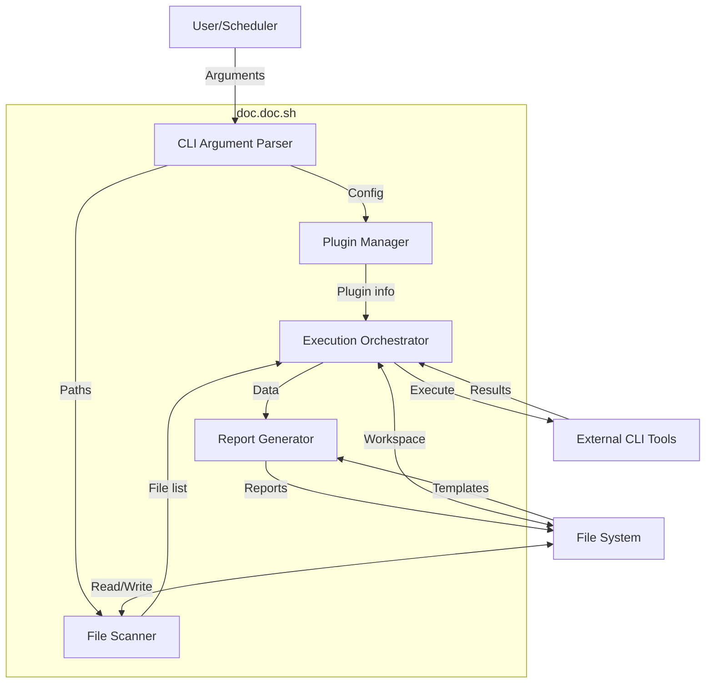
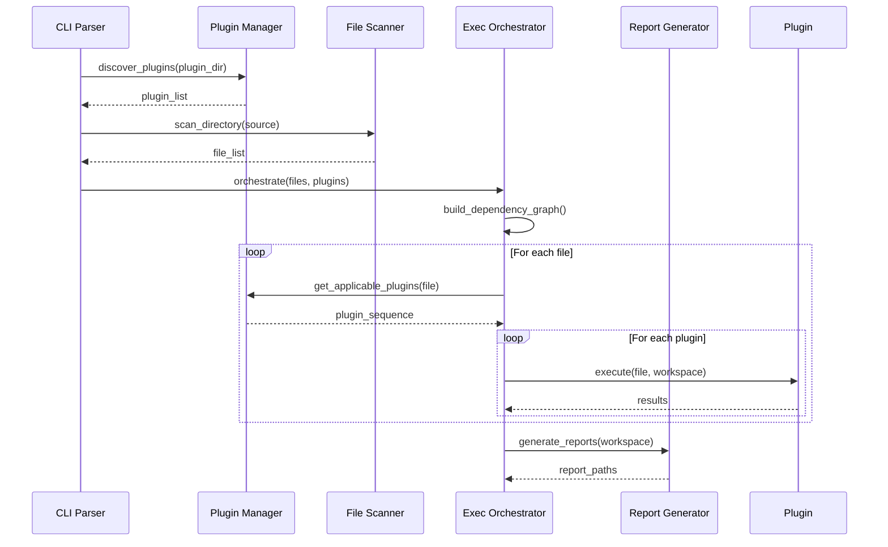
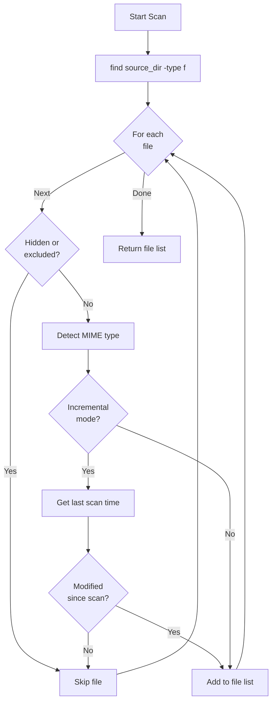
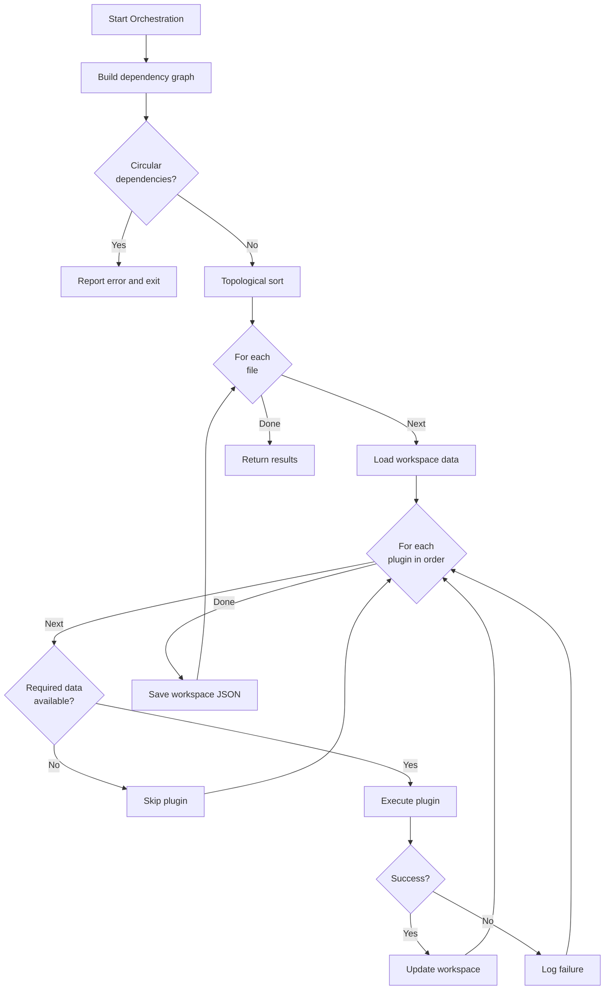
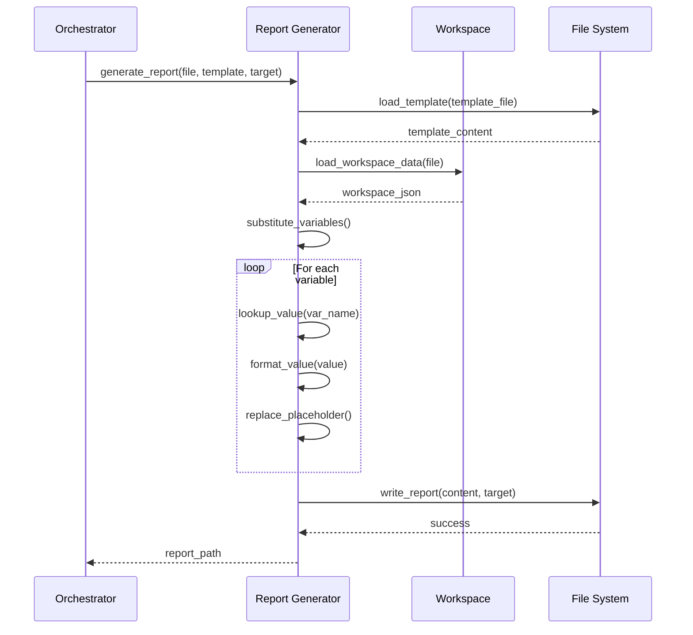

# 5. Building Block View

## 5.1 Whitebox Overall System

The doc.doc toolkit consists of five major building blocks that orchestrate file analysis and report generation through a plugin-based architecture.



### Contained Building Blocks

| Component | Responsibility | Key Interfaces |
|-----------|---------------|----------------|
| **CLI Argument Parser** | Parse command-line arguments, validate inputs, show help | `parse_arguments()`, `validate_config()`, `show_help()` |
| **Plugin Manager** | Discover plugins, load descriptors, validate capabilities | `discover_plugins()`, `load_descriptor()`, `check_tool_availability()` |
| **File Scanner** | Traverse directories, detect file types, filter files | `scan_directory()`, `detect_mime_type()`, `filter_by_type()` |
| **Execution Orchestrator** | Build dependency graph, schedule plugins, manage workspace | `build_dependency_graph()`, `execute_plugin()`, `update_workspace()` |
| **Report Generator** | Load templates, merge data, render Markdown | `load_template()`, `substitute_variables()`, `write_report()` |

### Important Interfaces



## 5.2 Level 1: CLI Argument Parser

### Purpose
Handles all command-line interaction, validates user inputs, and establishes runtime configuration.

### Responsibilities
- Parse POSIX-style command-line arguments
- Validate required arguments and paths
- Display help and usage information
- Set up logging verbosity
- Handle special commands (`-p list`, `--version`)

### Interface

**Input**:
```bash
Arguments: $@  # Command-line arguments array
Environment: PATH, HOME  # Shell environment variables
```

**Output**:
```bash
CONFIG associative array:
  SOURCE_DIR
  TEMPLATE_FILE
  TARGET_DIR
  WORKSPACE_DIR
  VERBOSE
  COMMAND (list|analyze)
```

**Functions**:
- `parse_arguments()` - Main argument parsing logic
- `show_help()` - Display usage information
- `show_version()` - Display version information
- `validate_paths()` - Check directory/file existence
- `set_defaults()` - Apply default configuration values

### Error Handling
- Missing required arguments → show help, exit 1
- Invalid paths → clear error message, exit 1
- Unknown flags → show help, exit 1
- Conflicting options → clear error message, exit 1

## 5.3 Level 1: Plugin Manager

### Purpose
Manages the plugin lifecycle including discovery, loading, validation, and tool availability checking.

### Responsibilities
- Discover plugins from platform-specific directories
- Parse and validate `descriptor.json` files
- Verify CLI tool availability for active plugins
- Provide plugin metadata to orchestrator
- Handle plugin list display (`-p list` command)

### Interface

**Input**:
```bash
PLUGIN_DIR      # Base plugin directory path
PLATFORM        # Detected OS (ubuntu, all, etc.)
```

**Output**:
```bash
PLUGINS array of:
  name
  description
  active (boolean)
  processes (mime_types, file_extensions)
  consumes (data requirements)
  provides (data outputs)
  execute_commandline
  install_commandline
  check_commandline
  tool_available (boolean)
```

**Functions**:
- `discover_plugins(plugin_dir, platform)` - Find all plugin descriptors
- `load_plugin_descriptor(desc_file)` - Parse JSON and extract metadata
- `validate_descriptor(plugin)` - Check required fields present
- `check_tool_availability(plugin)` - Execute check_commandline
- `list_plugins()` - Format and display plugin list
- `get_plugins_for_file(file_path, mime_type)` - Filter applicable plugins

### Plugin Discovery Algorithm

```mermaid
flowchart TD
    Start[Start Discovery] --> DetectOS[Detect Platform]
    DetectOS --> ScanAll[Scan plugins/all/]
    ScanAll --> ScanPlatform[Scan plugins/{platform}/]
    ScanPlatform --> FindDesc[Find descriptor.json files]
    FindDesc --> Loop{For each<br/>descriptor}
    Loop -->|Next| LoadDesc[Load JSON]
    LoadDesc --> Validate{Valid?}
    Validate -->|Yes| CheckTool[Check tool availability]
    Validate -->|No| LogError[Log validation error]
    CheckTool --> AddPlugin[Add to plugin list]
    LogError --> Loop
    AddPlugin --> Loop
    Loop -->|Done| Return[Return plugin list]
```

### Data Structures

**Plugin Descriptor Schema**:
```json
{
  "name": "string (required)",
  "description": "string (required)",
  "active": "boolean (default: false)",
  "processes": {
    "mime_types": ["string"],
    "file_extensions": ["string"]
  },
  "consumes": {
    "param_name": {
      "type": "string",
      "description": "string"
    }
  },
  "provides": {
    "param_name": {
      "type": "string",
      "description": "string"
    }
  },
  "execute_commandline": "string (required)",
  "install_commandline": "string (required)",
  "check_commandline": "string (required)"
}
```

## 5.4 Level 1: File Scanner

### Purpose
Recursively traverses source directory, identifies files, determines types, and builds file inventory.

### Responsibilities
- Recursive directory traversal
- File type detection (MIME type, extension)
- Filter hidden files and system directories
- Build list of files for analysis
- Detect changes since last scan (incremental analysis)

### Interface

**Input**:
```bash
SOURCE_DIR          # Root directory to scan
WORKSPACE_DIR       # For incremental detection
INCREMENTAL         # Boolean flag
```

**Output**:
```bash
FILE_LIST array of:
  file_path_absolute
  file_path_relative
  mime_type
  file_extension
  last_modified_timestamp
  file_size
  needs_analysis (boolean)
```

**Functions**:
- `scan_directory(source_dir)` - Main scanning entry point
- `detect_mime_type(file_path)` - Use `file` command
- `get_last_scan_time(file_path, workspace)` - Check workspace
- `is_file_modified(file_path, last_scan)` - Compare timestamps
- `filter_hidden_files(file_list)` - Apply exclusion rules

### Scanning Strategy



### Exclusion Rules
- Hidden files (starting with `.`) - excluded by default
- System directories (`.git/`, `node_modules/`, etc.) - excluded
- Symbolic links - followed with depth limit
- Permission denied - logged but not fatal

## 5.5 Level 1: Execution Orchestrator

### Purpose
Coordinates plugin execution using data-driven dependency resolution, manages workspace state, and ensures correct execution order.

### Responsibilities
- Build plugin dependency graph from consumes/provides
- Determine execution order automatically
- Execute plugins in data-dependency order
- Manage workspace JSON files
- Handle plugin failures gracefully
- Support incremental execution

### Interface

**Input**:
```bash
FILE_LIST           # Files to analyze
PLUGINS             # Available plugins
WORKSPACE_DIR       # State persistence location
```

**Output**:
```bash
WORKSPACE_FILES     # Updated JSON files per analyzed file
EXIT_CODE           # Overall success/failure
EXECUTION_LOG       # Plugin execution trace
```

**Functions**:
- `build_dependency_graph(plugins)` - Analyze consumes/provides
- `topological_sort(graph)` - Determine execution order
- `detect_circular_dependencies(graph)` - Validate graph
- `execute_plugin_sequence(file, plugins)` - Run plugins for one file
- `execute_plugin(plugin, file, workspace)` - Single plugin execution
- `load_workspace_data(file, workspace)` - Read existing JSON
- `update_workspace_data(file, data, workspace)` - Atomic write
- `lock_workspace_file(file)` - Concurrent access prevention

### Dependency Graph Algorithm



### Workspace Data Structure

**Workspace File**: `workspace/<file_hash>.json`
```json
{
  "file_path": "path/to/file.ext",
  "file_type": "application/pdf",
  "last_scanned": "2026-02-06T10:00:00Z",
  "file_size": 1234567,
  "file_last_modified": "2026-02-05T15:30:00Z",
  "file_owner": "user",
  "content": {
    "text": "extracted text content...",
    "word_count": 5432,
    "summary": "Document about...",
    "tags": ["keyword1", "keyword2"]
  },
  "plugins_executed": [
    {"name": "stat", "timestamp": "2026-02-06T10:00:01Z", "status": "success"},
    {"name": "ocrmypdf", "timestamp": "2026-02-06T10:00:05Z", "status": "success"}
  ]
}
```

**Lock File**: `workspace/<file_hash>.json.lock`
- Created before write, deleted after
- Contains PID and timestamp
- Prevents concurrent modifications

### Plugin Execution Pattern

```bash
# 1. Change to plugin directory
cd "${PLUGIN_DIR}/${plugin_name}"

# 2. Set up environment with workspace data
export file_path_absolute="${FILE_PATH}"
# ... export other available data ...

# 3. Execute plugin command
eval "${plugin_execute_commandline}"

# 4. Capture new data from exported variables
# Plugin sets: file_owner, file_size, etc.

# 5. Update workspace with new data
```

## 5.6 Level 1: Report Generator

### Purpose
Transforms workspace data into human-readable Markdown reports using customizable templates.

### Responsibilities
- Load template files
- Substitute variables with workspace data
- Generate per-file reports
- Apply consistent formatting
- Handle missing data gracefully

### Interface

**Input**:
```bash
TEMPLATE_FILE       # Markdown template with placeholders
WORKSPACE_DATA      # JSON data for substitution
TARGET_DIR          # Destination for reports
```

**Output**:
```bash
REPORT_FILES        # Generated Markdown files
```

**Functions**:
- `load_template(template_file)` - Read template content
- `substitute_variables(template, data)` - Replace placeholders
- `generate_report(file, workspace, template, target)` - Main generation
- `write_report(content, target_path)` - Write to file system
- `format_date(timestamp)` - Format timestamps
- `format_size(bytes)` - Human-readable sizes

### Template Syntax

**Variable Substitution**:
```markdown
# Analysis Report: {{file_path}}

- **File Type**: {{file_type}}
- **Size**: {{file_size}}
- **Last Modified**: {{file_last_modified}}
- **Owner**: {{file_owner}}

## Content Summary
{{content.summary}}

## Tags
{{content.tags}}
```

**Substitution Algorithm**:
1. Parse template line by line
2. Identify `{{variable_name}}` patterns
3. Look up variable in workspace data (support dot notation)
4. Replace with value or "(not available)" if missing
5. Apply formatting functions if specified (date, size, etc.)
6. Write result to target file

### Report Generation Flow



### Error Handling
- Template not found → use default template
- Variable missing → substitute with "(not available)"
- Invalid data format → log warning, use raw value
- Write failure → log error, continue with other files

## 5.7 Cross-Cutting Concepts

### Error Handling Strategy
All components follow consistent error handling:
- Validate inputs before processing
- Use exit codes (0=success, 1=error)
- Log errors to stderr
- Provide clear error messages to user
- Fail gracefully without corrupting state

### Logging Strategy
- Controlled by `-v` verbose flag
- Informational messages to stdout
- Errors to stderr
- Structured log format: `[TIMESTAMP] [LEVEL] [COMPONENT] Message`
- Levels: DEBUG, INFO, WARN, ERROR

### Configuration Management
- Command-line arguments override defaults
- Environment variables for advanced configuration
- No separate config file (keeps it simple)
- Sensible defaults for optional parameters

### Concurrency Handling
- Lock files prevent concurrent workspace modification
- File-level locking (not directory-level)
- Timeout on lock acquisition
- Automatic lock cleanup on exit

## 5.8 Design Decisions

### Why Bash?
- ✅ Native process orchestration and CLI tool invocation
- ✅ Ubiquitous availability on target platforms
- ✅ No installation overhead
- ✅ Direct file system access
- ⚠️ Complexity limit: Delegate complex logic to subcomponents

### Why Component Separation?
- ✅ Clear responsibilities enable testing
- ✅ Supports incremental development
- ✅ Easy to extend individual components
- ✅ Facilitates future refactoring if needed

### Why Data-Driven Orchestration?
- ✅ Automatic workflow adaptation as plugins change
- ✅ No explicit workflow configuration required
- ✅ Supports parallel execution of independent plugins
- ✅ Simplifies user experience

### Why JSON Workspace?
- ✅ Human-readable for debugging
- ✅ Easily parsed by external tools
- ✅ Flexible schema evolution
- ✅ Standard format with good tool support (jq)
