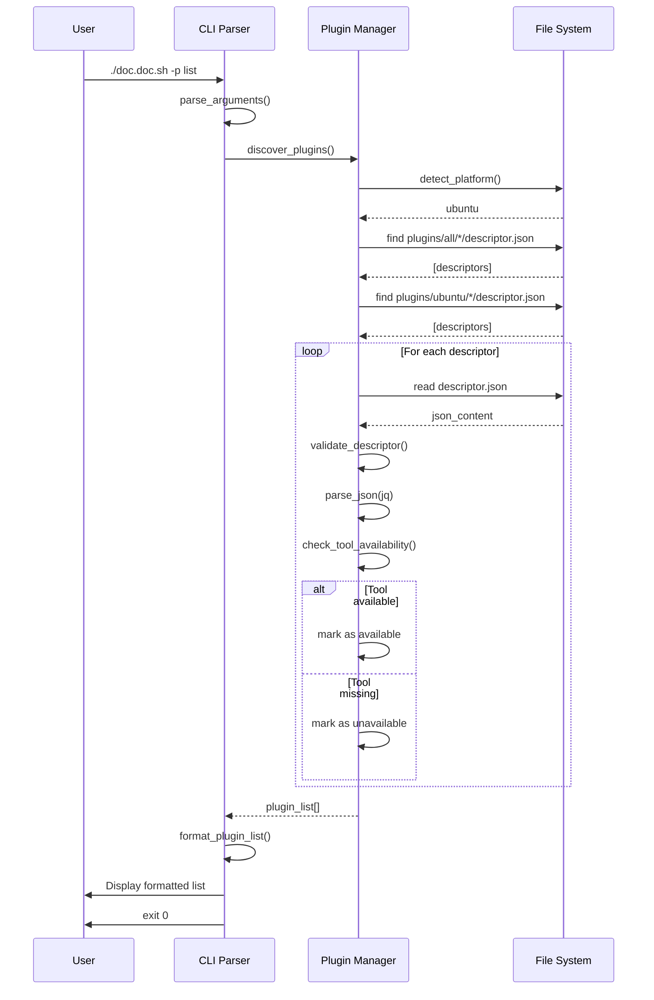
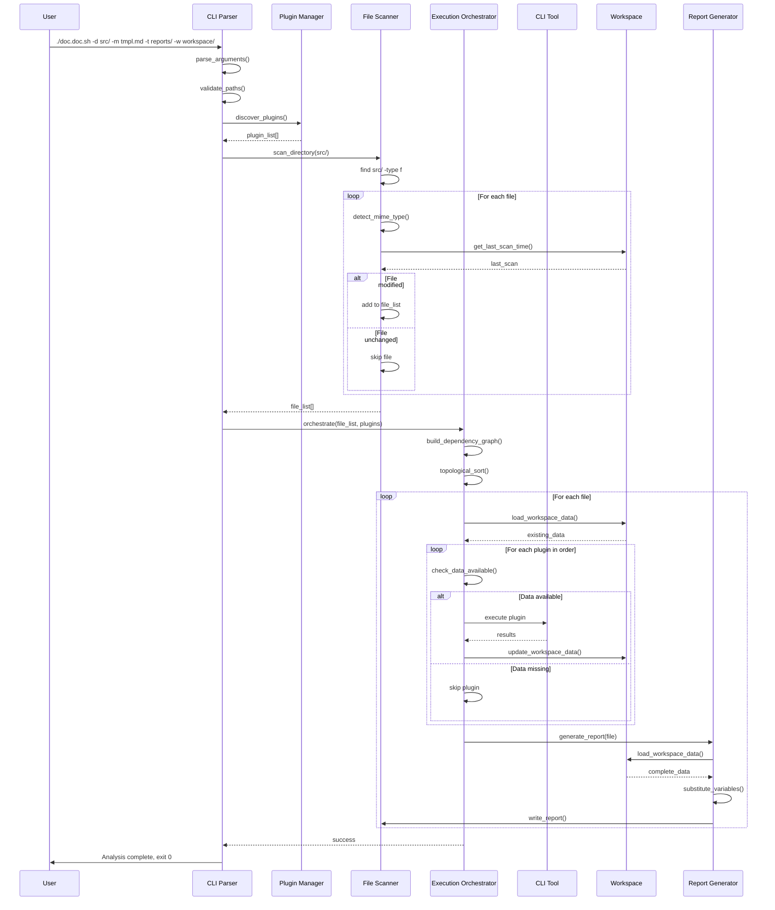
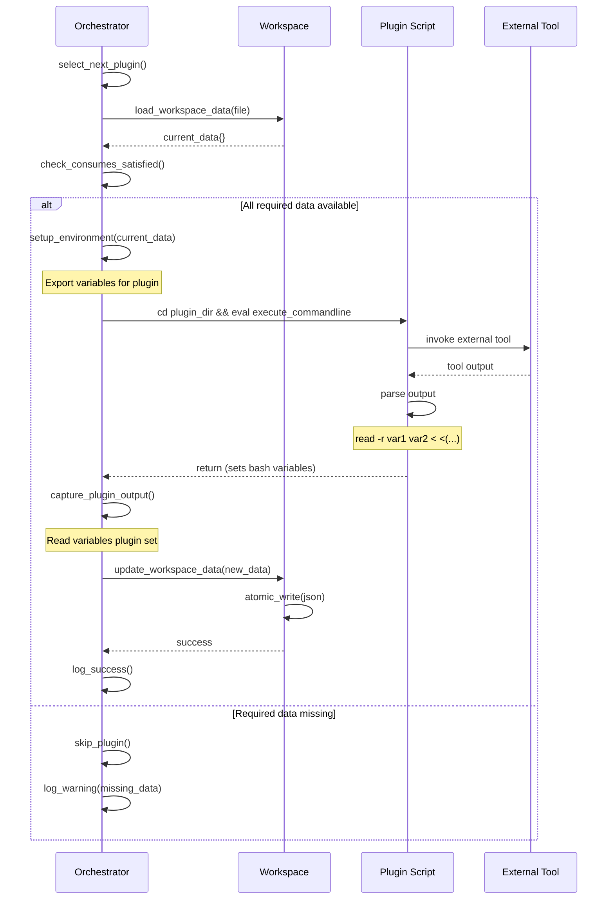
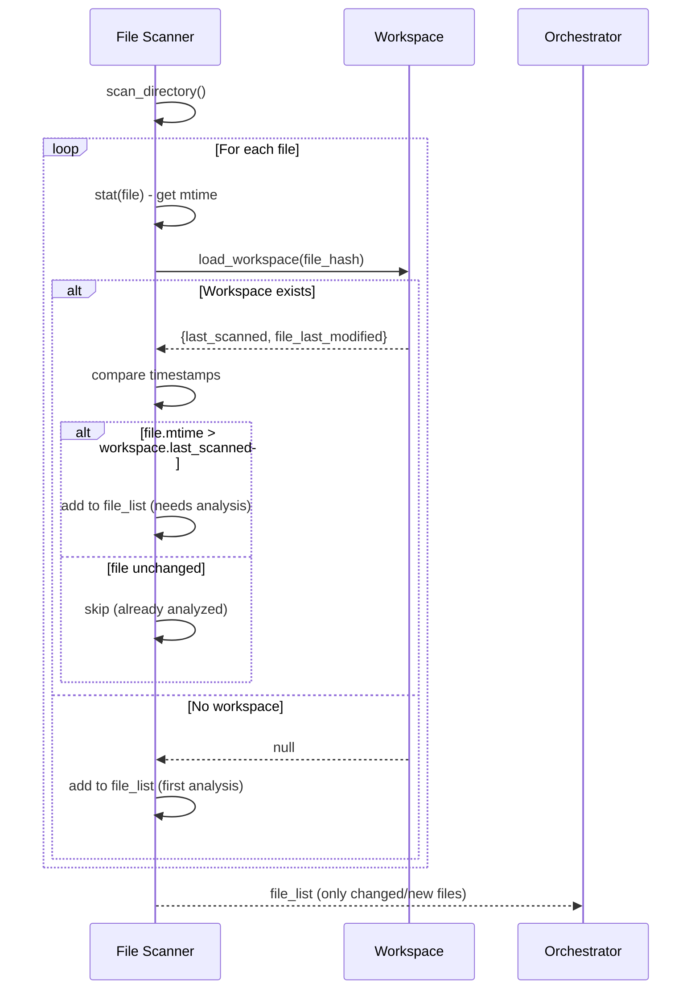
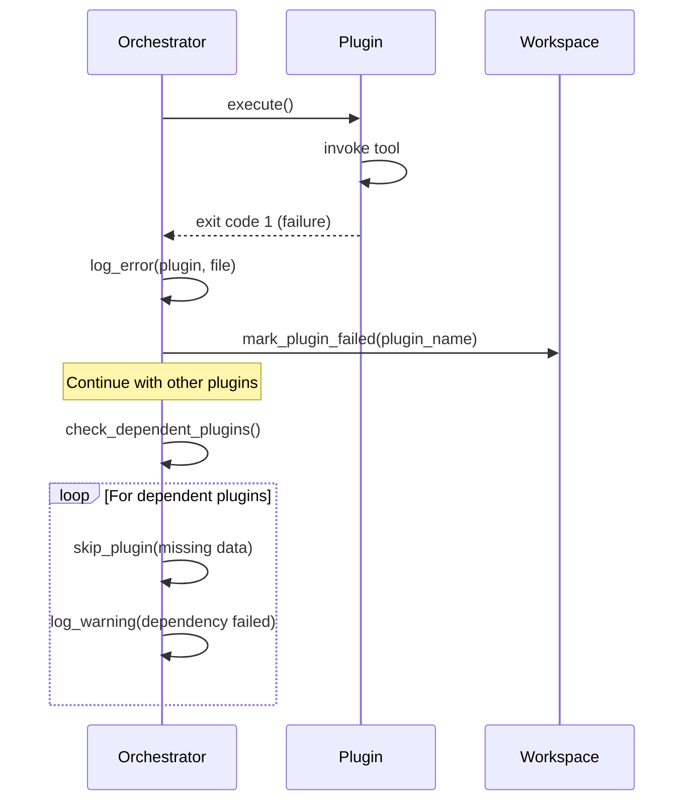
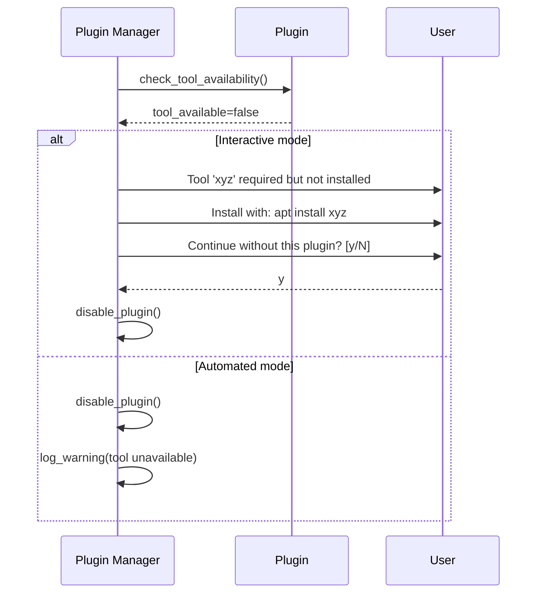
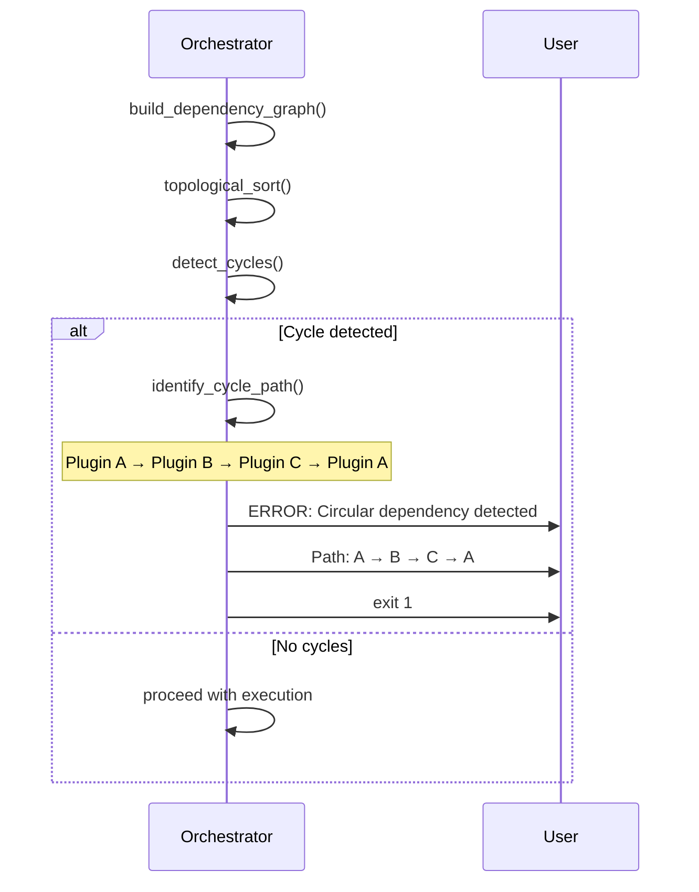

# 6. Runtime View

This section describes the dynamic behavior of the system, showing how components interact during key scenarios.

## 6.1 Plugin Listing Scenario (`-p list`)

This scenario demonstrates how the system discovers and displays available plugins.



### Steps

1. **User Invokes**: `./doc.doc.sh -p list`
2. **CLI Parsing**: Argument parser identifies `list` command
3. **Platform Detection**: System identifies OS (e.g., Ubuntu)
4. **Plugin Discovery**:
   - Scan `plugins/all/` for generic plugins
   - Scan `plugins/{platform}/` for platform-specific plugins
   - Find all `descriptor.json` files recursively
5. **Descriptor Loading**: For each plugin:
   - Read `descriptor.json` file
   - Validate required fields present
   - Parse JSON content
   - Execute `check_commandline` to verify tool availability
   - Mark plugin as available or unavailable
6. **List Formatting**:
   - Sort plugins alphabetically by name
   - Format output with name, description, status
   - Show active/inactive and available/unavailable states
7. **Display Output**: Print formatted list to stdout
8. **Exit**: Return exit code 0 for success

### Output Example

```
Available Plugins:
====================================

[ACTIVE] [AVAILABLE]   stat
  Extracts file metadata using stat command
  Consumes: file_path_absolute
  Provides: file_size, file_last_modified, file_owner, file_created

[INACTIVE] [UNAVAILABLE]   ocrmypdf
  Performs OCR on PDF files to extract text content
  Consumes: file_path_absolute
  Provides: content.text
  Required tool: ocrmypdf (not installed)

2 plugins found (1 active, 1 inactive)
```

### Error Cases

- **No plugins found**: Display "No plugins found" message, exit 0
- **All plugins unavailable**: Display list with unavailable status, exit 0
- **Malformed descriptor**: Log error, skip plugin, continue
- **Plugin directory missing**: Display "Plugin directory not found", exit 1

## 6.2 Directory Analysis Scenario (Main Workflow)

This scenario shows the complete file analysis workflow from directory scan to report generation.



### Steps

**Phase 1: Initialization (Preparation)**

1. **Parse Arguments**: Extract source, target, workspace, template paths
2. **Validate Paths**: Ensure directories exist and are accessible
3. **Discover Plugins**: Load all active plugins and check tool availability
4. **Scan Directory**: 
   - Recursively find all files in source directory
   - Detect MIME type for each file
   - Check if file modified since last scan (incremental)
   - Build file list for processing

**Phase 2: Dependency Analysis**

5. **Build Dependency Graph**:
   - Analyze each plugin's `consumes` and `provides` fields
   - Create directed graph: Plugin A → Plugin B if B consumes A's output
   - Detect circular dependencies (error if found)
6. **Topological Sort**:
   - Order plugins so dependencies execute first
   - Example: stat (provides file_size) → analyzer (consumes file_size)

**Phase 3: File Analysis (Per File)**

7. **Load Existing Workspace Data**:
   - Read `workspace/<hash>.json` if exists
   - Acquire lock file to prevent concurrent access
8. **Execute Plugin Sequence**:
   - For each plugin in dependency order:
     - Check if required data available in workspace
     - If available: Execute plugin, capture results
     - If unavailable: Skip plugin, log warning
     - Update workspace with new data
9. **Save Workspace**:
   - Write updated JSON atomically (temp file + rename)
   - Release lock file

**Phase 4: Report Generation (Per File)**

10. **Load Template**: Read Markdown template file
11. **Load Workspace Data**: Get complete analysis data for file
12. **Variable Substitution**: Replace `{{placeholders}}` with actual values
13. **Write Report**: Save Markdown file to target directory

**Phase 5: Completion**

14. **Summary**: Display statistics (files analyzed, reports generated)
15. **Exit**: Return exit code 0 for success, non-zero for errors

### Data Flow Example

**File**: `documents/manual.pdf`

1. **Scanner**:
   ```json
   {
     "file_path_absolute": "/home/user/documents/manual.pdf",
     "file_path_relative": "documents/manual.pdf",
     "mime_type": "application/pdf",
     "file_extension": ".pdf"
   }
   ```

2. **Plugin: stat** (executes first, no dependencies):
   ```json
   {
     "file_size": 1048576,
     "file_last_modified": "2026-02-05T10:30:00Z",
     "file_owner": "user",
     "file_created": "2026-01-15T09:00:00Z"
   }
   ```

3. **Plugin: ocrmypdf** (executes second, has file_path):
   ```json
   {
     "content": {
       "text": "Extracted text from PDF...",
       "word_count": 5432
     }
   }
   ```

4. **Workspace** (`workspace/abc123.json`):
   ```json
   {
     "file_path_absolute": "/home/user/documents/manual.pdf",
     "file_type": "application/pdf",
     "file_size": 1048576,
     "file_last_modified": "2026-02-05T10:30:00Z",
     "file_owner": "user",
     "content": {
       "text": "Extracted text from PDF...",
       "word_count": 5432
     },
     "last_scanned": "2026-02-06T11:00:00Z"
   }
   ```

5. **Report** (`reports/documents/manual.md`):
   ```markdown
   # Analysis Report: manual.pdf
   
   - **File Type**: application/pdf
   - **Size**: 1.0 MB
   - **Last Modified**: Feb 5, 2026 10:30 AM
   - **Owner**: user
   
   ## Content Summary
   Extracted text from PDF...
   
   **Word Count**: 5,432
   ```

### Performance Characteristics

- **Incremental Analysis**: Only modified files re-analyzed
- **Parallel Potential**: Independent files can be processed in parallel (future enhancement)
- **Streaming**: Files processed one at a time (memory efficient)
- **Caching**: Workspace provides persistent cache of analysis results

## 6.3 Plugin Execution Detail

This scenario shows the detailed interaction when executing a single plugin.



### Plugin Execution Steps

1. **Select Plugin**: Next plugin from dependency-ordered list
2. **Load Workspace**: Read current data for file from JSON
3. **Check Dependencies**:
   - Verify all `consumes` data present in workspace
   - If missing: Skip plugin, log warning, continue
4. **Setup Environment**:
   - Export workspace data as bash variables
   - Change directory to plugin location
   - Set up any plugin-specific environment
5. **Execute Command**:
   - Run `execute_commandline` from descriptor
   - Plugin invokes external tool (stat, file, etc.)
   - Plugin captures tool output
   - Plugin sets bash variables with results
6. **Capture Results**:
   - Read variables plugin set in environment
   - Extract new data according to `provides` declaration
7. **Update Workspace**:
   - Merge new data with existing workspace data
   - Write JSON atomically (temp file + rename)
   - Preserve timestamp of plugin execution
8. **Log Results**:
   - Record success/failure
   - Include timing information
   - Note any warnings

### Example: stat Plugin Execution

**Plugin Descriptor** (`plugins/ubuntu/stat/descriptor.json`):
```json
{
  "name": "stat",
  "consumes": {
    "file_path_absolute": {"type": "string"}
  },
  "provides": {
    "file_created": {"type": "integer"},
    "file_last_modified": {"type": "integer"},
    "file_owner": {"type": "string"},
    "file_size": {"type": "integer"}
  },
  "execute_commandline": "read -r file_created file_last_modified file_owner file_size < <(stat -c %W,%Y,%U,%s ${file_path_absolute})"
}
```

**Execution**:
1. Orchestrator exports: `file_path_absolute="/home/user/doc.txt"`
2. Changes to: `plugins/ubuntu/stat/`
3. Executes: `read -r file_created ... < <(stat -c %W,%Y,%U,%s /home/user/doc.txt)`
4. Tool returns: `1705323600,1707134400,user,2048`
5. Plugin sets: `file_created=1705323600`, `file_last_modified=1707134400`, etc.
6. Orchestrator captures these variables
7. Merges into workspace JSON:
   ```json
   {
     "file_created": 1705323600,
     "file_last_modified": 1707134400,
     "file_owner": "user",
     "file_size": 2048
   }
   ```

## 6.4 Incremental Analysis Scenario

Shows how the system avoids re-analyzing unchanged files.



### Incremental Logic

**Decision Tree**:
```
For each file:
  Does workspace JSON exist?
    NO → Analyze (first time)
    YES → 
      Is file.mtime > workspace.last_scanned?
        YES → Analyze (file modified)
        NO → Skip (file unchanged)
```

**Benefits**:
- ✅ Faster execution on repeated runs
- ✅ Lower resource usage
- ✅ Suitable for scheduled/automated execution
- ✅ Graceful handling of new files

**Workspace Timestamp**:
```json
{
  "file_path": "/path/to/file.txt",
  "file_last_modified": "2026-02-05T10:00:00Z",
  "last_scanned": "2026-02-06T09:00:00Z",
  ...
}
```
If `file_last_modified > last_scanned`: File changed, re-analyze

## 6.5 Error Handling Scenarios

### Plugin Failure



**Handling**:
1. Plugin fails → Log error with details
2. Mark plugin as failed in workspace
3. Continue processing other plugins
4. Skip plugins that depend on failed plugin's data
5. Generate report with available data
6. Overall exit code reflects failure

### Tool Not Available



**Handling**:
1. Check tool availability during plugin discovery
2. If unavailable:
   - Interactive: Prompt user with installation instructions
   - Automated: Log warning, disable plugin
3. Continue with available plugins
4. Report shows which plugins were skipped

### Circular Dependency



**Handling**:
1. Detect cycles during dependency graph construction
2. Identify complete cycle path for reporting
3. Clear error message to user with cycle details
4. Exit with error code 1
5. User must fix plugin descriptors to resolve

## 6.6 Performance Considerations

### Single-File Processing Time

```
File Analysis Time = Scanner + (Plugin₁ + Plugin₂ + ... + Pluginₙ) + Report Gen

Typical: 10-100ms + (50-500ms per plugin) + 10-50ms
Example with 3 plugins: ~200-1600ms per file
```

### Large Directory Strategy

For 10,000 files:
- **Full scan**: ~1-2 hours (all plugins, all files)
- **Incremental scan** (10% changed): ~6-12 minutes
- **Memory usage**: Constant (stream processing)
- **Disk I/O**: Sequential reads/writes (SSD-friendly)

### Optimization Opportunities

1. **Parallel File Processing**: Independent files in parallel (future)
2. **Plugin Caching**: Reuse tool results when possible
3. **Incremental Updates**: Only changed files (implemented)
4. **Batch Tool Invocation**: Multiple files per tool call (future)

## 6.7 Workflow Summary

**Key Runtime Characteristics**:

- ✅ **Sequential File Processing**: One file at a time (simple, memory-efficient)
- ✅ **Data-Driven Plugin Order**: Automatic dependency resolution
- ✅ **Incremental Analysis**: Skip unchanged files
- ✅ **Atomic Updates**: Workspace writes are transactional
- ✅ **Graceful Degradation**: Continue on plugin failures
- ✅ **Clear Error Reporting**: User-friendly messages
- ✅ **State Persistence**: Workspace enables resumption
