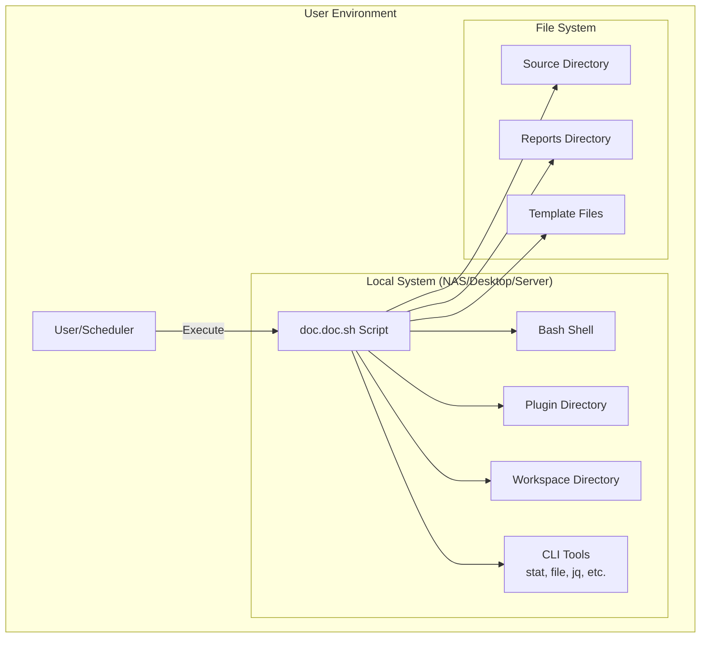

# 7. Deployment View

## Table of Contents

- [7.1 Infrastructure Overview](#71-infrastructure-overview)
- [7.2 Deployment Scenarios](#72-deployment-scenarios)
- [7.3 Platform-Specific Considerations](#73-platform-specific-considerations)
- [7.4 Deployment Options](#74-deployment-options)
- [7.5 Configuration Management](#75-configuration-management)
- [7.6 Resource Requirements](#76-resource-requirements)

This section describes how the doc.doc toolkit is deployed and executed in target environments.

## 7.1 Infrastructure Overview

The doc.doc toolkit operates as a **local command-line utility** with zero server infrastructure requirements. It runs entirely on the user's machine or NAS device.



## 7.2 Deployment Scenarios

### Scenario 1: Personal Desktop

**Environment**: Single-user Linux desktop or laptop

**Deployment**:
```bash
# Clone repository
git clone https://github.com/user/doc.doc.git
cd doc.doc

# Make script executable
chmod +x scripts/doc.doc.sh

# Run analysis
./scripts/doc.doc.sh -d ~/Documents -m template.doc.doc.md -t ~/Reports -w ~/workspace
```

**Characteristics**:
- ✅ Interactive usage
- ✅ User reviews reports in browser/editor
- ✅ On-demand execution
- ⚠️ Workspace typically small (hundreds of files)

### Scenario 2: NAS Device (Network Attached Storage)

**Environment**: Synology, QNAP, or similar NAS running Linux

**Deployment**:
```bash
# SSH into NAS
ssh admin@nas.local

# Install to shared volume
cd /volume1/scripts
git clone https://github.com/user/doc.doc.git
cd doc.doc
chmod +x scripts/doc.doc.sh

# Create scheduled task (via NAS UI or cron)
# Daily at 2 AM: Analyze shared documents
0 2 * * * /volume1/scripts/doc.doc/scripts/doc.doc.sh \
  -d /volume1/documents \
  -m /volume1/scripts/doc.doc/template.doc.doc.md \
  -t /volume1/reports \
  -w /volume1/workspace \
  >> /volume1/scripts/doc.doc/logs/analysis.log 2>&1
```

**Characteristics**:
- ✅ Automated/scheduled execution
- ✅ Large document collections (thousands of files)
- ✅ Incremental analysis essential
- ✅ Reports accessible via web interface or file sharing
- ⚠️ Non-interactive (no user prompts)

### Scenario 3: CI/CD Pipeline

**Environment**: GitHub Actions, GitLab CI, Jenkins

**Deployment** (GitHub Actions example):
```yaml
name: Documentation Analysis

on:
  push:
    paths:
      - 'docs/**'
  schedule:
    - cron: '0 1 * * *'  # Daily at 1 AM

jobs:
  analyze:
    runs-on: ubuntu-latest
    steps:
      - name: Checkout code
        uses: actions/checkout@v3
      
      - name: Checkout doc.doc
        uses: actions/checkout@v3
        with:
          repository: user/doc.doc
          path: doc.doc
      
      - name: Install tools
        run: |
          sudo apt-get update
          sudo apt-get install -y jq file
      
      - name: Run analysis
        run: |
          chmod +x doc.doc/scripts/doc.doc.sh
          doc.doc/scripts/doc.doc.sh \
            -d docs/ \
            -m doc.doc/template.doc.doc.md \
            -t reports/ \
            -w cache/workspace/
      
      - name: Upload reports
        uses: actions/upload-artifact@v3
        with:
          name: analysis-reports
          path: reports/
      
      - name: Cache workspace
        uses: actions/cache@v3
        with:
          path: cache/workspace/
          key: workspace-${{ hashFiles('docs/**') }}
```

**Characteristics**:
- ✅ Automated on code changes
- ✅ Integrates with version control
- ✅ Reports as build artifacts
- ✅ Cached workspace for incremental analysis
- ⚠️ Ephemeral environment (workspace must be cached)

### Scenario 4: Shared Server

**Environment**: Multi-user Linux server

**Deployment**:
```bash
# System administrator installs globally
sudo -i
cd /opt
git clone https://github.com/user/doc.doc.git
chmod +x /opt/doc.doc/scripts/doc.doc.sh
ln -s /opt/doc.doc/scripts/doc.doc.sh /usr/local/bin/doc.doc

# Each user maintains their own workspace
# User 1:
doc.doc -d ~/my_documents -m /opt/doc.doc/template.doc.doc.md \
  -t ~/reports -w ~/.doc.doc/workspace

# User 2:
doc.doc -d ~/research_papers -m /opt/doc.doc/template.doc.doc.md \
  -t ~/paper_reports -w ~/.doc.doc/workspace
```

**Characteristics**:
- ✅ Shared installation, separate workspaces
- ✅ Users customize templates and workflows
- ✅ Central tool updates
- ⚠️ Permission management required

## 7.3 Directory Structure

**Standard Installation**:
```
doc.doc/                          # Project root
├── scripts/
│   ├── doc.doc.sh                # Main script (entry point)
│   ├── template.doc.doc.md       # Default template
│   └── plugins/                  # Plugin directory
│       ├── all/                  # Cross-platform plugins
│       │   └── example/
│       │       └── descriptor.json
│       └── ubuntu/               # Ubuntu-specific plugins
│           └── stat/
│               ├── descriptor.json
│               └── install.sh
├── 01_vision/                    # Project documentation
├── 02_agile_board/
├── 03_documentation/
├── README.md
├── LICENSE
└── AGENTS.md
```

**User Data Directories** (runtime):
```
<user_defined>/
├── source/                       # Documents to analyze (user provides)
├── reports/                      # Generated reports (user provides)
└── workspace/                    # Analysis state (user provides)
    ├── abc123.json
    ├── def456.json
    └── .workspace_version
```

## 7.4 Installation Methods

### Method 1: Git Clone (Recommended for Development)

```bash
# Clone repository
git clone https://github.com/user/doc.doc.git
cd doc.doc

# Make script executable
chmod +x scripts/doc.doc.sh

# Run from repository
./scripts/doc.doc.sh -h
```

**Pros**: ✅ Easy updates (git pull), includes full source history  
**Cons**: ⚠️ Requires git installed

### Method 2: Download Release Archive

```bash
# Download latest release
wget https://github.com/user/doc.doc/releases/latest/download/doc.doc.tar.gz

# Extract
tar -xzf doc.doc.tar.gz
cd doc.doc

# Make executable
chmod +x scripts/doc.doc.sh

# Run
./scripts/doc.doc.sh -h
```

**Pros**: ✅ No git required, specific version control  
**Cons**: ⚠️ Manual updates

### Method 3: System Package Manager (Future)

```bash
# Ubuntu/Debian (future)
sudo add-apt-repository ppa:user/doc.doc
sudo apt update
sudo apt install doc.doc

# Homebrew (macOS/Linux) (future)
brew install doc.doc

# Run globally
doc.doc -h
```

**Pros**: ✅ System integration, automatic updates  
**Cons**: ⚠️ Not yet implemented, requires package maintenance

### Method 4: Docker Container (Optional, Future)

```bash
# Run in container (future option)
docker run -v $(pwd)/docs:/data/source \
           -v $(pwd)/reports:/data/reports \
           -v $(pwd)/workspace:/data/workspace \
           docdoc/docdoc:latest \
           -d /data/source \
           -m /app/template.md \
           -t /data/reports \
           -w /data/workspace
```

**Pros**: ✅ Isolated environment, consistent dependencies  
**Cons**: ⚠️ Docker overhead, not aligned with lightweight vision

## 7.5 Dependency Management

### System Requirements

**Minimum Requirements**:
- **Operating System**: Linux (Ubuntu 20.04+, Debian 10+, or compatible)
- **Shell**: Bash 4.0 or later
- **Disk Space**: 10 MB (script and plugins)
- **Disk I/O**: Depends on analyzed directory size
- **Memory**: Minimal (~10-50 MB during execution)

**Optional Requirements**:
- `jq` - JSON processing (highly recommended for complex plugins)
- Platform-specific tools (defined by active plugins)

### Tool Installation Verification

**Check Script**: `scripts/check_dependencies.sh` (future)
```bash
#!/usr/bin/env bash
# Verify required tools installed

check_tool() {
  local tool="$1"
  local required="$2"
  
  if command -v "${tool}" &> /dev/null; then
    echo "✓ ${tool} found"
    return 0
  else
    if [ "${required}" = "yes" ]; then
      echo "✗ ${tool} REQUIRED but not found"
      return 1
    else
      echo "⚠ ${tool} optional, not found"
      return 0
    fi
  fi
}

echo "Checking dependencies..."
check_tool "bash" "yes"
check_tool "stat" "yes"
check_tool "find" "yes"
check_tool "file" "yes"
check_tool "jq" "no"

# Check bash version
bash_version=$(bash --version | head -n1 | grep -oP '\\d+\\.\\d+')
if (( $(echo "${bash_version} >= 4.0" | bc -l) )); then
  echo "✓ Bash version ${bash_version} OK"
else
  echo "✗ Bash version ${bash_version} too old, need 4.0+"
fi
```

## 7.6 Scalability Considerations

### Small Scale (< 1,000 files)
- **Execution Time**: Seconds to minutes
- **Workspace Size**: < 10 MB
- **Memory Usage**: < 50 MB
- **Deployment**: Any method works well

### Medium Scale (1,000 - 10,000 files)
- **Execution Time**: Minutes to 1 hour (full), minutes (incremental)
- **Workspace Size**: 10 MB - 100 MB
- **Memory Usage**: < 100 MB
- **Deployment**: NAS or server, scheduled execution recommended

### Large Scale (10,000+ files)
- **Execution Time**: Hours (full), 10-30 minutes (incremental)
- **Workspace Size**: 100 MB - 1 GB+
- **Memory Usage**: < 200 MB
- **Deployment**: Server with SSD, definitely use incremental analysis
- **Considerations**: 
  - Workspace cleanup strategy needed
  - Consider data partitioning (analyze subdirectories separately)
  - Monitor disk I/O and adjust scheduling

## 7.7 Backup and Recovery

### Workspace Backup

**Backup Strategy**:
```bash
# Backup workspace before major changes
tar -czf workspace-backup-$(date +%Y%m%d).tar.gz workspace/

# Restore if needed
tar -xzf workspace-backup-20260206.tar.gz
```

**Incremental Backup**:
```bash
# Use rsync for efficient workspace backups
rsync -av --delete workspace/ backup/workspace/
```

### Disaster Recovery

**Workspace Corruption**:
1. Delete corrupted workspace: `rm -rf workspace/*.json`
2. Re-run analysis (full scan): `./doc.doc.sh ...`
3. System rebuilds workspace from scratch

**Lost Reports**:
1. Reports can be regenerated from workspace
2. Re-run: `./doc.doc.sh ...` (uses cached workspace data, fast)

## 7.8 Monitoring and Logging

### Log Files

**Logging Strategy**:
```bash
# Log to file
./doc.doc.sh -d docs/ -m tmpl.md -t reports/ -w workspace/ -v \
  >> /var/log/doc.doc/analysis.log 2>&1

# Rotate logs (logrotate config)
/var/log/doc.doc/analysis.log {
    weekly
    rotate 12
    compress
    delaycompress
    missingok
    notifempty
}
```

### Monitoring

**Health Checks** (for scheduled execution):
```bash
#!/usr/bin/env bash
# Monitor doc.doc execution

LOG_FILE="/var/log/doc.doc/analysis.log"
MAX_AGE_HOURS=25  # Expected to run daily

# Check if analysis ran recently
last_run=$(stat -c %Y "${LOG_FILE}")
current_time=$(date +%s)
age_hours=$(( (current_time - last_run) / 3600 ))

if [ ${age_hours} -gt ${MAX_AGE_HOURS} ]; then
  echo "ALERT: doc.doc hasn't run in ${age_hours} hours"
  # Send notification
  send_alert "doc.doc analysis overdue"
fi

# Check for errors
if tail -n 100 "${LOG_FILE}" | grep -q "ERROR"; then
  echo "ALERT: Errors detected in recent analysis"
  send_alert "doc.doc analysis errors detected"
fi
```

## 7.9 Security Considerations

### File Permissions

**Recommended Permissions**:
```bash
# Script executable by owner
chmod 700 scripts/doc.doc.sh

# Plugins readable by owner
chmod 600 scripts/plugins/**/*.json

# Workspace writable by owner only
chmod 700 workspace/
chmod 600 workspace/*.json
```

### Multi-User Environment

**User Isolation**:
- Each user maintains separate workspace
- Shared plugin directory (read-only)
- Private target and workspace directories

### Sensitive Data

**Best Practices**:
- ✅ All processing happens locally
- ✅ No network transmission of file content
- ✅ Workspace contains potentially sensitive metadata
- ⚠️ Workspace directory should have restricted permissions
- ⚠️ Reports may contain sensitive summaries (protect appropriately)

## 7.10 Update Strategy

### Script Updates

**Git-Based**:
```bash
cd doc.doc
git pull origin main
# Script automatically updated
```

**Release-Based**:
```bash
# Download new version
wget https://github.com/user/doc.doc/releases/latest/download/doc.doc.tar.gz
# Extract to temporary location
# Test new version
# Replace old version if successful
```

### Plugin Updates

**Backward Compatibility**:
- New plugins added to `plugins/` directory
- Old plugins remain available
- Workspace format backward compatible
- Users can choose which plugins to activate

### Workspace Migration

**Schema Changes**:
```bash
# Automatic migration on first run (future)
./doc.doc.sh -d docs/ -m tmpl.md -t reports/ -w workspace/
# Script detects old workspace version
# Migrates data automatically
# Preserves original data
```

## 7.11 Troubleshooting

### Common Issues

| Issue | Symptom | Solution |
|-------|---------|----------|
| **Permission Denied** | `bash: ./doc.doc.sh: Permission denied` | `chmod +x scripts/doc.doc.sh` |
| **Tool Not Found** | `stat: command not found` | Install missing tool: `apt install coreutils` |
| **Workspace Locked** | Plugin hangs | Delete stale `.lock` files: `rm workspace/*.lock` |
| **JSON Parse Error** | `jq: parse error` | Corrupt workspace, delete and re-run |
| **Out of Disk Space** | Write failed | Clean old workspace data: `rm workspace/*.json` |

### Debug Mode

```bash
# Enable bash debugging
bash -x scripts/doc.doc.sh -d docs/ -m tmpl.md -t reports/ -w workspace/ -v

# Shows every command executed
# Helps identify where failures occur
```

## 7.12 Production Checklist

**Before Deploying**:
- [ ] Bash 4.0+ installed and available
- [ ] Required CLI tools installed (stat, find, file)
- [ ] Script has execute permissions
- [ ] Plugin directory structure correct
- [ ] Test run on small dataset successful
- [ ] Workspace directory writable
- [ ] Reports directory configured
- [ ] Logging configured (if automated)
- [ ] Scheduled task configured (if automated)
- [ ] Backup strategy defined
- [ ] Monitoring alerts configured (if critical)
- [ ] Documentation reviewed by users

**After Deployment**:
- [ ] Verify first analysis run successful
- [ ] Check workspace created correctly
- [ ] Review generated reports
- [ ] Monitor resource usage (disk, memory)
- [ ] Validate incremental analysis works
- [ ] Test plugin listing (`-p list`)
- [ ] Document any environment-specific configurations
