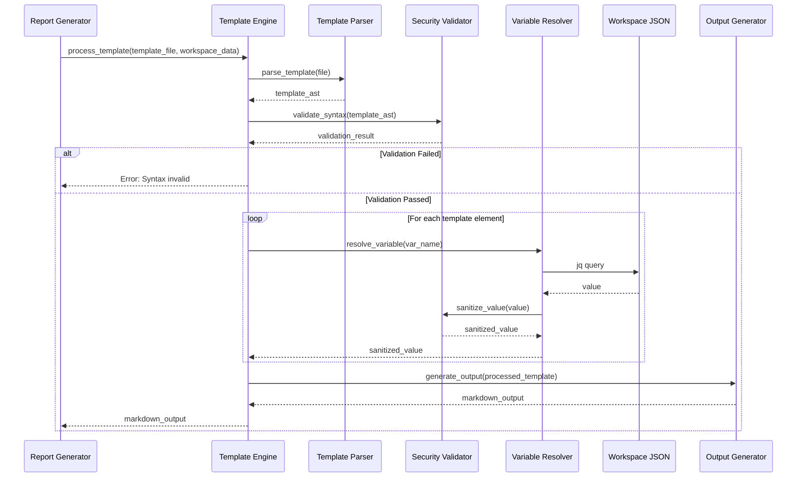

## 0011 Template Engine Concept

## Table of Contents

- [Purpose](#purpose)
- [Rationale](#rationale)
- [Architecture Overview](#architecture-overview)
- [Template Syntax](#template-syntax)
- [Security Architecture](#security-architecture)
- [Data Flow](#data-flow)
- [Implementation Strategy](#implementation-strategy)
- [Integration Points](#integration-points)
- [Error Handling](#error-handling)
- [Performance Considerations](#performance-considerations)
- [Testing Strategy](#testing-strategy)
- [Related Documentation](#related-documentation)

## Purpose

The Template Engine transforms workspace JSON data into formatted Markdown reports by processing templates with embedded control structures (variable substitution, conditionals, loops, comments). It provides a user-friendly way to customize report format without programming knowledge while enforcing strict security boundaries to prevent template injection attacks.

**Core Capabilities**:
- Variable substitution with dot notation: `{{file_path}}`, `{{content.word_count}}`
- Conditional rendering: `{{#if variable}}...{{else}}...{{/if}}`
- Array iteration: `{{#each array}}{{this}}{{@index}}{{/each}}`
- Template comments: `{{! documentation comment}}`
- Security enforcement: No code execution, sanitization, limits, timeouts

## Rationale

### Problem Statement

Initial architecture ([ADR-0005](../09_architecture_decisions/ADR_0005_template_based_report_generation.md)) used simple `{{variable}}` substitution, but real-world templates require:

1. **Conditional Sections**: Show "No summary available" message instead of empty section when data missing
2. **Array Iteration**: Display tags, plugin results, file lists in formatted lists without manual string manipulation
3. **Template Documentation**: Inline comments to explain template structure for team collaboration
4. **Professional Output**: Reports that adapt to data availability, never showing awkward empty sections or literal "[]"

**Example Limitation**:
```markdown
## Tags: {{content.tags}}
```
If `tags` is empty, output is literally `Tags: []`. Unprofessional and unhelpful.

**Solution with Template Engine**:
```markdown
{{#if content.tags}}
## Tags
{{#each content.tags}}
- {{this}}
{{/each}}
{{else}}
*No tags assigned to this file*
{{/if}}
```
Result: Professional output regardless of data availability.

### Design Principles

1. **User-Friendly**: Non-programmers can create templates using familiar Mustache-like syntax
2. **Security-First**: No code execution possible; templates are data transformation only
3. **Fail-Safe**: Malformed templates fail with clear errors, never produce partial/corrupted output
4. **Performance-Bounded**: Complexity limits prevent resource exhaustion
5. **Alignment with Requirements**: Implements [req_0040](../../../01_vision/02_requirements/03_accepted/req_0040_template_engine_implementation.md), [req_0049](../../../01_vision/02_requirements/03_accepted/req_0049_template_injection_prevention.md)

## Architecture Overview

### Component Structure

```
┌─────────────────────────────────────────────────────────┐
│              Template Engine Component                  │
│                                                         │
│  ┌──────────────┐  ┌──────────────┐  ┌──────────────┐│
│  │   Template   │  │   Variable   │  │  Conditional ││
│  │    Parser    │─▶│   Resolver   │  │  Evaluator   ││
│  └──────────────┘  └──────────────┘  └──────────────┘│
│         │                 │                   │        │
│         │                 ▼                   ▼        │
│         │          ┌──────────────┐  ┌──────────────┐│
│         │          │     Loop     │  │   Comment    ││
│         │          │  Processor   │  │   Stripper   ││
│         │          └──────────────┘  └──────────────┘│
│         │                 │                   │        │
│         └─────────────────┼───────────────────┘        │
│                           ▼                            │
│                  ┌──────────────┐                     │
│                  │   Security   │                     │
│                  │  Validator   │                     │
│                  └──────────────┘                     │
│                           │                            │
│                           ▼                            │
│                  ┌──────────────┐                     │
│                  │    Output    │                     │
│                  │  Generator   │                     │
│                  └──────────────┘                     │
└─────────────────────────────────────────────────────────┘
```

### Component Responsibilities

| Component | Responsibility | Security Role |
|-----------|---------------|---------------|
| **Template Parser** | Parse template file, identify syntax elements | Validate syntax, reject malformed templates |
| **Variable Resolver** | Look up variables in workspace JSON, substitute values | Sanitize values before substitution |
| **Conditional Evaluator** | Evaluate `{{#if}}` blocks, determine truthiness | Prevent code execution in conditions |
| **Loop Processor** | Iterate over arrays with `{{#each}}`, provide loop context | Enforce iteration limits, prevent infinite loops |
| **Comment Stripper** | Remove `{{! comment}}` from output | Ensure comments don't leak into output |
| **Security Validator** | Enforce all security constraints | Iteration limits, nesting limits, timeout enforcement |
| **Output Generator** | Produce final Markdown output | Final sanitization pass, encoding normalization |

### Location in Architecture

**File**: `scripts/components/orchestration/template_engine.sh`  
**Layer**: Orchestration (utility component used by Report Generator)  
**Dependencies**:
- `jq` (JSON parsing and XPath-like queries)
- Core logging component (error reporting)
- Input validation component (sanitization functions)

## Template Syntax

### 1. Variable Substitution

**Syntax**: `{{variable_name}}` or `{{nested.field.name}}`

**Behavior**:
- Replace with value from workspace JSON
- Support dot notation for nested fields
- Missing variables → empty string (silent fallback)
- Special characters escaped for Markdown safety

**Examples**:
```markdown
# Analysis Report: {{filename}}

**Path**: {{file_path_relative}}
**Size**: {{file_size_human}}
**Word Count**: {{content.word_count}}
**Modified**: {{format_date file_last_modified}}
```

**Data Context** (workspace JSON):
```json
{
  "filename": "report.pdf",
  "file_path_relative": "documents/report.pdf",
  "file_size_human": "2.3 MB",
  "content": {
    "word_count": 5432
  },
  "file_last_modified": "2026-02-10T14:30:00Z"
}
```

**Output**:
```markdown
# Analysis Report: report.pdf

**Path**: documents/report.pdf
**Size**: 2.3 MB
**Word Count**: 5432
**Modified**: 2026-02-10 14:30:00 UTC
```

### 2. Conditional Rendering

**Syntax**: 
```markdown
{{#if variable}}
  Content shown if variable is truthy
{{else}}
  Optional else clause
{{/if}}
```

**Truthiness**:
- **Truthy**: Non-empty string, non-zero number, non-empty array, object
- **Falsy**: Empty string `""`, zero `0`, empty array `[]`, null, undefined

**Examples**:

**Basic Conditional**:
```markdown
{{#if content.summary}}
## Summary
{{content.summary}}
{{/if}}
```

**With Else Clause**:
```markdown
{{#if content.tags}}
## Tags
...tags list...
{{else}}
*No tags assigned*
{{/if}}
```

**Nested Conditionals**:
```markdown
{{#if has_analysis}}
{{#if content.word_count}}
Word count: {{content.word_count}}
{{else}}
Text extraction failed
{{/if}}
{{/if}}
```

### 3. Loop Iteration

**Syntax**:
```markdown
{{#each array}}
  {{this}}        - Current element
  {{@index}}      - Zero-based index
{{/each}}
```

**Examples**:

**Simple Array Iteration**:
```markdown
{{#if content.tags}}
## Tags
{{#each content.tags}}
- {{this}}
{{/each}}
{{/if}}
```

**With Index**:
```markdown
{{#each plugins_executed}}
{{@index}}. **{{this.name}}**: {{this.status}} ({{this.timestamp}})
{{/each}}
```

**Nested Loops** (limit: 5 levels):
```markdown
{{#each file_types}}
### {{this.type}}
{{#each this.files}}
- {{this.path}} ({{this.size}})
{{/each}}
{{/each}}
```

**Empty Array Handling**:
```markdown
{{#each results}}
- {{this}}
{{/each}}
{{#if results}}{{else}}
*No results available*
{{/if}}
```

### 4. Comments

**Syntax**: `{{! comment text}}`

**Behavior**:
- Removed from output entirely
- Can appear inline or as block
- Useful for template documentation

**Examples**:
```markdown
{{! File metadata section - populated by stat plugin}}
## File Information
- **Size**: {{file_size_human}}
- **Modified**: {{file_last_modified}}

{{! TODO: Add file permissions when available}}
```

### 5. Built-in Helper Functions

**Format Date**:
```markdown
{{format_date last_scanned}}
Output: 2026-02-12 10:30:00 UTC
```

**Human-Readable Size**:
```markdown
{{file_size_human}}
Input: 2456789 bytes
Output: 2.3 MB
```

**Safe Filename**:
```markdown
{{safe_filename file_path}}
Input: /path/to/my file (copy).pdf
Output: my_file_copy.pdf
```

## Security Architecture

### Threat Model

**Primary Threat**: **Template Injection** (OWASP Top 10, CWE-94)

**Attack Scenarios**:
1. Malicious template executes shell commands
2. Template extracts sensitive data via code execution
3. Complex template causes denial-of-service (infinite loops, memory exhaustion)
4. Variable values contain injection payloads that break output format or execute code

**Risk Rating**: HIGH (Risk Score: 174, per security scope `scope_template_processing_001`)

### Defense-in-Depth Controls

#### Layer 1: No Code Execution

**Controls**:
- ❌ **FORBIDDEN**: `eval`, `exec`, command substitution `$(...)`, backticks
- ❌ **FORBIDDEN**: Dynamic variable names `${!var}`
- ❌ **FORBIDDEN**: Shell environment access `$HOME`, `$PATH`
- ❌ **FORBIDDEN**: File system operations from templates
- ❌ **FORBIDDEN**: Network access from templates
- ✅ **ALLOWED**: String operations, comparisons, JSON path resolution only

**Implementation**:
```bash
# CORRECT: Static parsing only
if [[ "$value" =~ \{\{([^}]+)\}\} ]]; then
  var_name="${BASH_REMATCH[1]}"
  var_value=$(jq -r ".$var_name" <<< "$workspace_data")
  output="${output/\{\{$var_name\}\}/$var_value}"
fi

# WRONG: Code execution vulnerability
eval "output=\"${template_content}\""  # DO NOT DO THIS
```

#### Layer 2: Variable Sanitization

**Controls**:
- Escape shell metacharacters: `;`, `|`, `&`, `$`, backticks, `()`, `<`, `>`
- Escape Markdown formatting characters (context-dependent): `*`, `_`, `[`, `]`, backticks
- Limit variable value size: Maximum 1MB per variable
- Normalize unicode to prevent homograph attacks

**Implementation**:
```bash
sanitize_variable_value() {
  local value="$1"
  
  # Escape shell metacharacters
  value="${value//\$/\\$}"      # Dollar sign
  value="${value//\`/\\`}"      # Backtick
  value="${value//;/\\;}"       # Semicolon
  value="${value//|/\\|}"       # Pipe
  value="${value//&/\\&}"       # Ampersand
  
  # Limit size
  if (( ${#value} > 1048576 )); then
    value="${value:0:1048576}...[truncated]"
  fi
  
  echo "$value"
}
```

#### Layer 3: Iteration Limits

**Controls**:
- Maximum total iterations per template: **10,000**
- Maximum loop nesting depth: **5 levels**
- Iteration counter tracked globally across all loops
- Exceeding limit aborts template processing immediately

**Implementation**:
```bash
declare -g ITERATION_COUNT=0
declare -g MAX_ITERATIONS=10000
declare -g NESTING_DEPTH=0
declare -g MAX_NESTING=5

process_loop() {
  if (( ++NESTING_DEPTH > MAX_NESTING )); then
    log "ERROR" "TEMPLATE" "Loop nesting depth exceeded (max: $MAX_NESTING)"
    return 1
  fi
  
  for item in "${array[@]}"; do
    if (( ++ITERATION_COUNT > MAX_ITERATIONS )); then
      log "ERROR" "TEMPLATE" "Iteration limit exceeded (max: $MAX_ITERATIONS)"
      return 1
    fi
    # ... process item ...
  done
  
  ((NESTING_DEPTH--))
}
```

#### Layer 4: Processing Timeout

**Controls**:
- Default timeout: **30 seconds**
- Configurable per template or globally
- Timeout wrapper aborts entire process
- Partial output discarded (fail closed)

**Implementation**:
```bash
process_template() {
  local template_file="$1"
  local workspace_data="$2"
  local timeout="${3:-30}"
  
  timeout "${timeout}s" _process_template_impl "$template_file" "$workspace_data" || {
    local exit_code=$?
    if (( exit_code == 124 )); then
      log "ERROR" "TEMPLATE" "Template processing timeout (${timeout}s)"
      return 2
    fi
    return "$exit_code"
  }
}
```

#### Layer 5: Syntax Validation

**Controls**:
- Validate template syntax **BEFORE** processing
- Check balancing: Each `{{#if}}` has matching `{{/if}}`
- Check balancing: Each `{{#each}}` has matching `{{/each}}`
- Reject templates with unbalanced or malformed tags
- Report syntax errors with line numbers

**Implementation**:
```bash
validate_template_syntax() {
  local template="$1"
  local line_num=0
  local if_count=0
  local each_count=0
  
  while IFS= read -r line; do
    ((line_num++))
    
    if [[ "$line" =~ \{\{#if ]]; then ((if_count++)); fi
    if [[ "$line" =~ \{\{/if\}\} ]]; then ((if_count--)); fi
    if [[ "$line" =~ \{\{#each ]]; then ((each_count++)); fi
    if [[ "$line" =~ \{\{/each\}\} ]]; then ((each_count--)); fi
    
    if (( if_count < 0 )); then
      log "ERROR" "TEMPLATE" "Unbalanced {{/if}} at line $line_num"
      return 1
    fi
    if (( each_count < 0 )); then
      log "ERROR" "TEMPLATE" "Unbalanced {{/each}} at line $line_num"
      return 1
    fi
  done <<< "$template"
  
  if (( if_count != 0 )); then
    log "ERROR" "TEMPLATE" "Unclosed {{#if}} blocks (count: $if_count)"
    return 1
  fi
  if (( each_count != 0 )); then
    log "ERROR" "TEMPLATE" "Unclosed {{#each}} blocks (count: $each_count)"
    return 1
  fi
  
  return 0
}
```

### Security Test Cases (Critical)

From [req_0049](../../../01_vision/02_requirements/03_accepted/req_0049_template_injection_prevention.md):

1. **Code Execution Attempts**:
   - Template: `{{$(whoami)}}` → Should output literal string, not execute command
   - Template: Variables containing `; rm -rf /` → Escaped, harmless in output
   - Template: Backticks in variable values → Escaped

2. **Denial of Service**:
   - Template with 100,000 iteration loop → Aborted at 10,000
   - Template with 10 nesting levels → Aborted at 6
   - Template processing > 30 seconds → Aborted with timeout

3. **Information Disclosure**:
   - Template accessing `$HOME`, `$USER` → Not accessible (no environment access)
   - Template reading `/etc/passwd` → No file system access

## Data Flow

### End-to-End Processing Flow



### Data Context Structure

**Input: Workspace JSON**
```json
{
  "file_path": "/path/to/document.pdf",
  "file_path_relative": "documents/document.pdf",
  "file_size": 2456789,
  "file_size_human": "2.3 MB",
  "file_type": "application/pdf",
  "file_last_modified": "2026-02-10T14:30:00Z",
  "last_scanned": "2026-02-12T10:00:00Z",
  "content": {
    "text": "Extracted text...",
    "word_count": 5432,
    "summary": "Document discusses...",
    "tags": ["annual-report", "finance", "2025"]
  },
  "plugins_executed": [
    {"name": "stat", "status": "success", "timestamp": "2026-02-12T10:00:01Z"},
    {"name": "ocrmypdf", "status": "success", "timestamp": "2026-02-12T10:00:15Z"}
  ]
}
```

## Implementation Strategy

### State Machine Parser

**States**:
- `TEXT`: Normal text, look for template tags
- `IN_CONDITIONAL`: Inside `{{#if}}...{{/if}}` block
- `IN_LOOP`: Inside `{{#each}}...{{/each}}` block
- `IN_COMMENT`: Inside `{{! comment }}`

**Transitions**:
```
TEXT --[{{#if var}}]--> IN_CONDITIONAL
TEXT --[{{#each array}}]--> IN_LOOP
TEXT --[{{! comment}}]--> IN_COMMENT (immediately strips, returns to TEXT)
IN_CONDITIONAL --[{{/if}}]--> TEXT
IN_LOOP --[{{/each}}]--> TEXT
```

**Stack Management**:
- Conditional stack: Track nested `{{#if}}` blocks
- Loop stack: Track nested `{{#each}}` blocks and current item/index
- Each stack entry includes: type, variable name, current state

### Parsing Algorithm (Simplified)

```bash
_process_template_impl() {
  local template_file="$1"
  local workspace_data="$2"
  
  # Load and validate template
  local template=$(<"$template_file")
  validate_template_syntax "$template" || return 1
  
  # Initialize state
  local output=""
  local line_num=0
  declare -a conditional_stack=()
  declare -a loop_stack=()
  
  # Process line by line
  while IFS= read -r line; do
    ((line_num++))
    
    # Check for template directives
    if [[ "$line" =~ \{\{#if[[:space:]]+([^}]+)\}\} ]]; then
      # Start conditional block
      local var_name="${BASH_REMATCH[1]}"
      local var_value=$(jq -r ".$var_name" <<< "$workspace_data")
      conditional_stack+=("$var_name:$var_value")
      
    elif [[ "$line" =~ \{\{/if\}\} ]]; then
      # End conditional block
      unset 'conditional_stack[-1]'
      
    elif [[ "$line" =~ \{\{#each[[:space:]]+([^}]+)\}\} ]]; then
      # Start loop block
      local array_name="${BASH_REMATCH[1]}"
      local array_json=$(jq -c ".$array_name" <<< "$workspace_data")
      loop_stack+=("$array_name:$array_json")
      
    elif [[ "$line" =~ \{\{/each\}\} ]]; then
      # End loop block
      unset 'loop_stack[-1]'
      
    elif [[ "$line" =~ \{\{!([^}]*)\}\} ]]; then
      # Comment - skip line
      continue
      
    elif [[ "$line" =~ \{\{([^}]+)\}\} ]]; then
      # Variable substitution
      local var_name="${BASH_REMATCH[1]}"
      local var_value=$(resolve_variable "$var_name" "$workspace_data")
      var_value=$(sanitize_variable_value "$var_value")
      line="${line/\{\{$var_name\}\}/$var_value}"
      output+="$line\n"
      
    else
      # Regular text line
      if should_include_line conditional_stack; then
        output+="$line\n"
      fi
    fi
    
    # Security: Check iteration count
    if (( ITERATION_COUNT > MAX_ITERATIONS )); then
      log "ERROR" "TEMPLATE" "Iteration limit exceeded at line $line_num"
      return 1
    fi
  done <<< "$template"
  
  echo -e "$output"
}
```

**Note**: Actual implementation handles nested structures, loop contexts (`{{this}}`, `{{@index}}`), and else clauses.

## Integration Points

### 1. Report Generator (Primary Consumer)

**Integration**: Report Generator calls Template Engine for each file

```bash
# In report_generator.sh
generate_report_for_file() {
  local file_hash="$1"
  local template_file="$2"
  local target_dir="$3"
  
  # Load workspace data
  local workspace_file="$WORKSPACE_DIR/files/${file_hash}.json"
  local workspace_data=$(<"$workspace_file")
  
  # Process template
  local report_content
  if report_content=$(process_template "$template_file" "$workspace_data"); then
    # Write report
    local file_path=$(jq -r '.file_path_relative' <<< "$workspace_data")
    local report_file="$target_dir/${file_path}.analysis.md"
    mkdir -p "$(dirname "$report_file")"
    echo "$report_content" > "$report_file"
    log "INFO" "REPORTER" "Generated report: $report_file"
  else
    log "ERROR" "REPORTER" "Template processing failed for: $file_hash"
    return 1
  fi
}
```

### 2. Workspace Manager (Data Provider)

**Integration**: Template Engine queries workspace JSON via jq

```bash
# Workspace provides structured JSON
{
  "file_path": "/path/to/file",
  "content": { ... },
  "plugins_executed": [ ... ]
}

# Template Engine accesses via jq
jq -r '.content.word_count' <<< "$workspace_data"
```

### 3. CLI (User-Facing)

**Integration**: User specifies template file via `-m` argument

```bash
./doc.doc.sh -d ./documents -m ./my-template.md -t ./reports
```

## Error Handling

### Error Categories and Responses

| Error Type | Example | Response | Exit Code |
|------------|---------|----------|-----------|
| **Syntax Error** | Unbalanced `{{#if}}` | Report line number, abort processing | 1 |
| **Security Violation** | Iteration limit exceeded | Log security event, abort processing | 3 |
| **Timeout** | Processing > 30 seconds | Abort processing, discard partial output | 2 |
| **Missing Variable** | `{{undefined_var}}` | Substitute empty string, continue | 0 (success) |
| **Invalid JSON** | Malformed workspace data | Report parsing error, abort | 1 |
| **File Not Found** | Template file missing | Clear error message, abort | 1 |

### Error Message Format

**Interactive Mode**:
```
ERROR: Template syntax error in template.md:42
  Unclosed {{#if}} block starting at line 38
  Expected {{/if}} before end of file
```

**Non-Interactive Mode**:
```
[2026-02-12T10:30:00Z] [ERROR] [TEMPLATE] Syntax: Unclosed {{#if}} block | File: template.md | Line: 38
```

## Performance Considerations

### Performance Targets

| Metric | Target | Rationale |
|--------|--------|-----------|
| **Template Processing Time** | < 1 second per file | Interactive responsiveness |
| **Large Template** (1000 lines) | < 2 seconds | Reasonable for complex templates |
| **Variable Substitution** | < 1ms per variable | Fast string replacement |
| **Loop Processing** | < 10ms per 1000 items | Efficient iteration |
| **Memory Usage** | < 50MB per template | Prevent memory exhaustion |

### Optimization Strategies

1. **Single Template Load**: Load template once, reuse for all files (Report Generator responsibility)
2. **Efficient Parsing**: Single-pass state machine parser, avoid multiple template scans
3. **Lazy Evaluation**: Only resolve variables that appear in output (conditionals may skip blocks)
4. **jq Caching**: Cache jq queries for repeated variable access patterns
5. **String Buffering**: Build output incrementally, minimize string copies

### Complexity Analysis

**Time Complexity**:
- Template parsing: O(n) where n = template lines
- Variable substitution: O(m) where m = number of variables
- Loop processing: O(l × i) where l = loops, i = items per loop
- Overall: O(n + m + l×i), bounded by iteration limit

**Space Complexity**:
- Template storage: O(n)
- Workspace data: O(d) where d = JSON size
- Output buffer: O(n + d) (template + expanded data)
- Stack depth: O(5) (maximum nesting depth)

## Testing Strategy

### Unit Tests (Required for DoD)

**Variable Substitution**:
- Simple variables: `{{var}}` → value
- Nested variables: `{{obj.field}}` → value
- Missing variables: `{{undefined}}` → empty string
- Special characters in values: escaped properly
- Very long values: truncated appropriately

**Conditionals**:
- Truthy evaluation: non-empty string, non-zero, non-empty array
- Falsy evaluation: empty string, zero, empty array, undefined
- Else clause: alternative content rendered
- Nested conditionals: correct nesting evaluation

**Loops**:
- Non-empty arrays: iterate correctly
- Empty arrays: skip loop body
- Loop context: `{{this}}` and `{{@index}}` work correctly
- Nested loops: multiply iterations correctly

**Comments**:
- Inline comments: removed from output
- Block comments: removed from output
- Multi-line comments: handled correctly

**Syntax Validation**:
- Balanced tags: pass validation
- Unbalanced `{{#if}}`: fail with line number
- Unbalanced `{{#each}}`: fail with line number
- Malformed tags: fail with clear error

### Security Tests (Critical)

**Code Execution Prevention**:
- Template with `$(command)`: not executed, literal output
- Variable with `;command`: escaped, harmless
- Variable with backticks: escaped

**Denial of Service Prevention**:
- Loop with 100,000 iterations: aborted at 10,000
- Nested loops (10 levels): aborted at 6
- Infinite loop: aborted by iteration limit
- Processing > 30 seconds: aborted with timeout

### Integration Tests

**Complete Workflow**:
- Load template + workspace JSON → produce markdown
- Multiple files with same template → consistent output
- Template error handling: continue with other files
- Large dataset (1000 files): performance acceptable

### Performance Tests

**Benchmarks**:
- Simple template (100 lines, 20 variables): < 100ms
- Complex template (1000 lines, nested loops): < 2 seconds
- Large workspace (100KB JSON): < 1 second
- Batch processing (1000 files): linear scaling

## Related Documentation

### Architecture

- **ADR-0011**: [Bash Template Engine with Control Structures](../09_architecture_decisions/ADR_0011_bash_template_engine_with_control_structures.md) - Architecture decision
- **ADR-0005**: [Template-Based Report Generation](../09_architecture_decisions/ADR_0005_template_based_report_generation.md) - Superseded, simple substitution
- **Building Block View**: [Section 5.6 Report Generator](../05_building_block_view/05_building_block_view.md#56-report-generator)

### Requirements

- **req_0040**: [Template Engine Implementation](../../../01_vision/02_requirements/03_accepted/req_0040_template_engine_implementation.md) - PRIMARY requirement
- **req_0049**: [Template Injection Prevention](../../../01_vision/02_requirements/03_accepted/req_0049_template_injection_prevention.md) - Security requirements
- **req_0005**: [Template-Based Reporting](../../../01_vision/02_requirements/03_accepted/req_0005_template_based_reporting.md) - Original concept

### Security

- **Security Scope**: [Template Processing Security](../../../01_vision/04_security/02_scopes/04_template_processing_security.md) - Comprehensive security analysis
- **Security Concept**: [Security Architecture](08_0007_security_architecture.md) - Layer 5: Template Security

### Features

- **feature_0008**: [Template Engine Implementation](../../../02_agile_board/02_analyze/feature_0008_template_engine.md) - Implementation work item
- **feature_0010**: [Report Generator](../../../02_agile_board/02_analyze/feature_0010_report_generator.md) - Consumer of template engine

---


## Traceability and Documentation Updates (2026-02-13)

This concept has been updated to address tester and architect findings regarding missing test plans, incomplete test coverage, and incomplete documentation. The following actions have been taken:

- Comprehensive test plan drafted: [testplan_feature_0008_template_engine.md](../../../03_documentation/02_tests/testplan_feature_0008_template_engine.md)
- New requirement for test coverage gap: [req_0057_template_engine_test_coverage_gap.md](../../../01_vision/02_requirements/01_funnel/req_0057_template_engine_test_coverage_gap.md)
- All core features, error handling, fallback, and security scenarios are now explicitly covered in requirements, architecture, and test documentation.
- Traceability to requirements: req_0040, req_0049, req_0069, req_0057

**Document Status**: Updated for coverage and traceability gaps  
**Last Updated**: 2026-02-13  
**Next Review**: After feature_0008 implementation, verify actual implementation and test coverage align with concept
