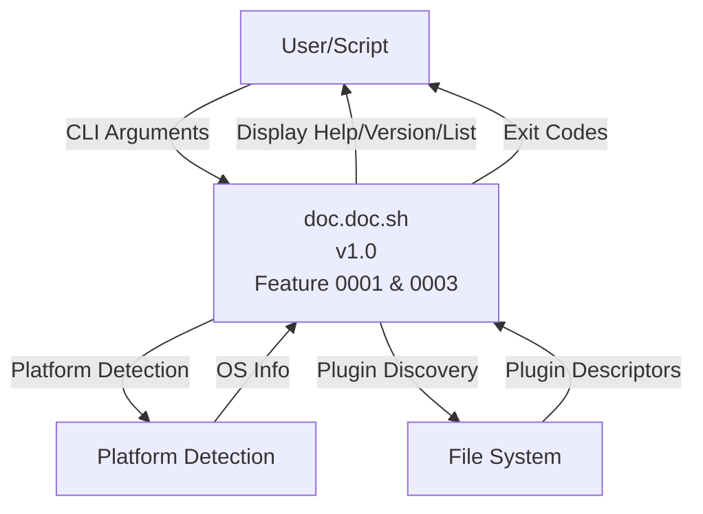
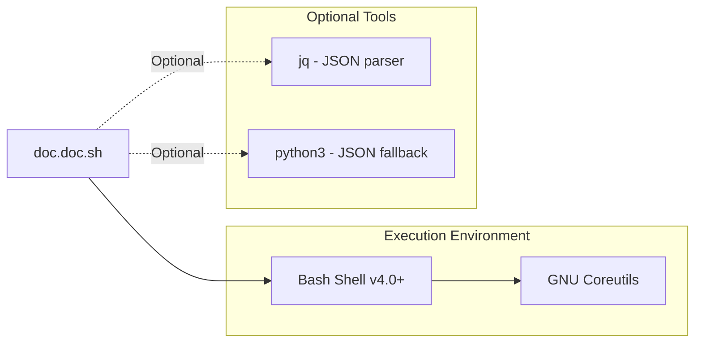
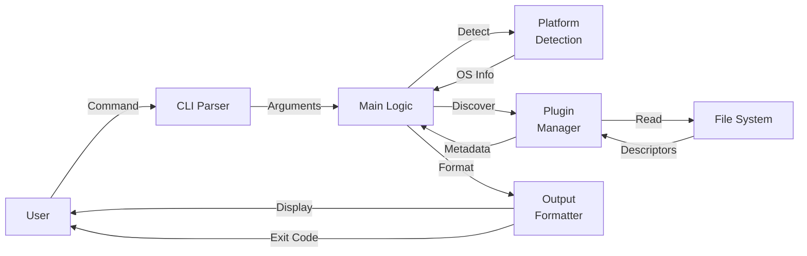

# 3. System Scope and Context (Implementation)

**Status**: Living Document  
**Last Updated**: 2026-02-08  
**Vision Reference**: [System Scope and Context](../../../01_vision/03_architecture/03_system_scope_and_context/03_system_scope_and_context.md)

## Overview

This document describes the **implemented** system boundaries, external interfaces, and context of the doc.doc toolkit as currently built.

## Table of Contents

- [3.1 Business Context (Implemented)](#31-business-context-implemented)
  - [Current System Boundary](#current-system-boundary)
  - [Implemented External Entities](#implemented-external-entities)
  - [Current Interface Details](#current-interface-details)
- [3.2 Technical Context (Implemented)](#32-technical-context-implemented)
  - [Current Technology Stack](#current-technology-stack)
  - [Implemented Dependencies](#implemented-dependencies)
  - [Platform Support Status](#platform-support-status)
  - [Data Flow (Current Implementation)](#data-flow-current-implementation)
- [3.3 Implemented Use Cases](#33-implemented-use-cases)
  - [UC1: Plugin Discovery ✅ IMPLEMENTED](#uc1-plugin-discovery--implemented)
  - [UC2: Help Display ✅ IMPLEMENTED](#uc2-help-display--implemented)
  - [UC3: Version Information ✅ IMPLEMENTED](#uc3-version-information--implemented)
  - [UC4: Verbose Logging ✅ IMPLEMENTED](#uc4-verbose-logging--implemented)
  - [Use Cases Not Yet Implemented](#use-cases-not-yet-implemented)
- [3.4 Current System Boundaries](#34-current-system-boundaries)
  - [What the System Does Now ✅](#what-the-system-does-now-)
  - [What the System Does NOT Do Yet ⏳](#what-the-system-does-not-do-yet-)
- [3.5 External Integration Points (Future)](#35-external-integration-points-future)
- [Summary](#summary)

## 3.1 Business Context (Implemented)

The doc.doc toolkit currently operates as a command-line utility providing foundational capabilities for file analysis orchestration.

### Current System Boundary



### Implemented External Entities

| Entity | Input | Output | Purpose | Status |
|--------|-------|--------|---------|--------|
| **User/Script** | CLI arguments | Help, version, plugin list, exit codes | Initiates operations | ✅ Implemented |
| **File System** | Plugin descriptors | Plugin metadata | Provides plugin information | ✅ Implemented |
| **Platform Detection** | System files (/etc/os-release) | Platform identifier | Determines OS for plugin selection | ✅ Implemented |

**Not Yet Implemented**:
- File scanning and analysis
- Workspace read/write
- Report generation
- External CLI tool invocation

### Current Interface Details

#### CLI Interface (Implemented) ✅

```bash
./doc.doc.sh [OPTIONS]

Implemented Options:
  -h, --help        Display help text
  --version         Display version information
  -v, --verbose     Enable verbose logging
  -p list           List available plugins

Framework Ready (Not Functional):
  -d <dir>          Source directory (parsed, not processed)
  -m <file>         Template file (parsed, not processed)
  -t <dir>          Target directory (parsed, not processed)
  -w <dir>          Workspace directory (parsed, not processed)
  -f fullscan       Fullscan mode (parsed, not processed)
```

**Exit Codes** (Implemented):
```bash
0 - Success (help, version, plugin list)
1 - Invalid arguments
2-5 - Reserved for future file/plugin/report/workspace errors
```

#### Platform Detection Interface (Implemented) ✅

**Input**:
- `/etc/os-release` (Linux distributions)
- `uname -s` (fallback for other Unix systems)

**Output**:
- `PLATFORM` global variable (e.g., "ubuntu", "debian", "darwin", "generic")

**Logic**:
1. Try `/etc/os-release` → extract `ID` field
2. Fallback to `uname -s` → map to platform name
3. Default to "generic" if both fail

#### Plugin Discovery Interface (Implemented) ✅

**Input**:
- `plugins/all/*/descriptor.json` (cross-platform plugins)
- `plugins/{PLATFORM}/*/descriptor.json` (platform-specific plugins)

**Processing**:
1. Scan plugin directories based on detected platform
2. Read and validate JSON descriptors
3. Check tool availability via `check_commandline`
4. Build plugin metadata list

**Output** (for `-p list`):
```
Available Plugins:
====================================

[ACTIVE] [AVAILABLE]     stat
  Extracts file metadata using stat command

[INACTIVE] [UNAVAILABLE]  ocrmypdf
  OCR processing for PDF files
  Tool not installed: ocrmypdf

2 plugins discovered (1 active, 1 inactive)
```

## 3.2 Technical Context (Implemented)

### Current Technology Stack



### Implemented Dependencies

**Core Requirements** ✅:
- Bash shell v4.0+ (strict requirement)
- GNU Coreutils:
  - `dirname` - Path manipulation
  - Standard I/O operations

**Optional Tools** 🔄:
- `jq` - JSON parsing (preferred)
- `python3` - JSON parsing fallback (ADR-0011)
- `stat`, `file`, `find` - For future file analysis

**No Dependencies on**:
- ❌ Databases (SQLite, MySQL, PostgreSQL)
- ❌ Web servers or network services
- ❌ GUI frameworks or desktop environments
- ❌ Language runtimes (beyond Bash)

### Platform Support Status

| Platform | Status | Tested | Notes |
|----------|--------|--------|-------|
| Ubuntu 20.04+ | ✅ Primary | Yes | Fully supported |
| Debian-based | ✅ Supported | Partial | Should work (Linux) |
| Generic Linux | ✅ Fallback | No | POSIX compliance targeted |
| macOS | ⏳ Planned | No | BSD stat differences noted |
| WSL | ⏳ Planned | No | Should work like Linux |
| Alpine Linux | ⏳ Future | No | Minimal environment testing |

### Data Flow (Current Implementation)



**Current Flow Examples**:

1. **Help Display**: User → CLI → Main → Output → User
2. **Version Display**: User → CLI → Main → Output → User
3. **Plugin Listing**: User → CLI → Main → Platform Detection → Plugin Manager → File System → Format → User

**Not Yet Implemented**:
- File scanning flow
- Plugin execution flow
- Workspace interaction
- Report generation

## 3.3 Implemented Use Cases

### UC1: Plugin Discovery ✅ IMPLEMENTED

**Trigger**: User executes `./doc.doc.sh -p list`

**Current Flow**:
1. CLI parses `-p list` command
2. Platform detection identifies OS (e.g., "ubuntu")
3. Plugin manager scans:
   - `plugins/all/*/descriptor.json`
   - `plugins/ubuntu/*/descriptor.json`
4. For each descriptor:
   - Parse JSON (jq or python3 fallback)
   - Validate required fields (name, description, execute_commandline)
   - Check tool availability via `check_commandline`
   - Mark as [ACTIVE]/[INACTIVE] and [AVAILABLE]/[UNAVAILABLE]
5. Sort plugins alphabetically by name
6. Format and display list with descriptions
7. Exit with code 0

**Output Example**:
```
Available Plugins:
====================================

[ACTIVE] [AVAILABLE]     docx2txt
  Extract text from DOCX files
  
[INACTIVE] [UNAVAILABLE]  ocrmypdf
  OCR for scanned PDFs
  Missing tool: ocrmypdf

2 plugins discovered (1 active, 1 inactive)
```

**Status**: ✅ Fully functional (Feature 0003)

---

### UC2: Help Display ✅ IMPLEMENTED

**Trigger**: User executes `./doc.doc.sh` or `./doc.doc.sh -h`

**Current Flow**:
1. CLI detects no arguments or `-h` flag
2. Display help text with:
   - Usage syntax
   - Option descriptions
   - Exit codes
   - Examples
   - Project information
3. Exit with code 0

**Status**: ✅ Fully functional (Feature 0001)

---

### UC3: Version Information ✅ IMPLEMENTED

**Trigger**: User executes `./doc.doc.sh --version`

**Current Flow**:
1. CLI detects `--version` flag
2. Display version, copyright, license
3. Exit with code 0

**Status**: ✅ Fully functional (Feature 0001)

---

### UC4: Verbose Logging ✅ IMPLEMENTED

**Trigger**: User executes any command with `-v` flag

**Current Flow**:
1. CLI detects `-v` flag, sets `VERBOSE=true`
2. All subsequent `log()` calls show INFO and DEBUG level messages
3. WARN and ERROR always shown regardless

**Status**: ✅ Fully functional (Feature 0001)

---

### Use Cases Not Yet Implemented

- ⏳ UC5: Incremental Analysis (planned)
- ⏳ UC6: Force Full Re-analysis (planned)
- ⏳ UC7: First-Time Analysis (planned)
- ⏳ UC8: File Type Filtering (planned)

## 3.4 Current System Boundaries

### What the System Does Now ✅

1. **CLI Interaction**: Accepts and validates command-line arguments
2. **Platform Detection**: Identifies operating system/distribution
3. **Plugin Discovery**: Finds and catalogs available plugins
4. **Plugin Validation**: Checks plugin descriptors and tool availability
5. **Information Display**: Shows help, version, and plugin information
6. **Error Handling**: Provides clear error messages with exit codes
7. **Logging**: Structured logging with verbosity control

### What the System Does NOT Do Yet ⏳

1. **File Analysis**: No actual file processing
2. **Plugin Execution**: Plugin orchestration not implemented
3. **Workspace Management**: No state persistence
4. **Report Generation**: No report creation
5. **Tool Installation**: No installation automation
6. **Incremental Analysis**: No change detection

## 3.5 External Integration Points (Future)

**Planned Interfaces**:
- Workspace JSON files → External tools (jq, Python scripts)
- Generated reports → Documentation systems
- Exit codes → CI/CD pipelines
- Cron/systemd → Scheduled execution

**Current Integration**:
- Exit codes functional for scripting
- Output suitable for piping to grep, awk, etc.

## Summary

The current implementation establishes the **foundational context** for the doc.doc system:
- Clear system boundary (CLI interface)
- Platform detection for cross-platform support
- Plugin discovery infrastructure
- User interaction patterns

**Next Steps** to achieve full vision context:
1. Implement file scanning component
2. Add plugin execution orchestrator
3. Develop workspace management
4. Create report generator

The implemented architecture maintains the vision's emphasis on **local-only processing**, **composability**, and **extensibility** while building incrementally toward the complete system.
