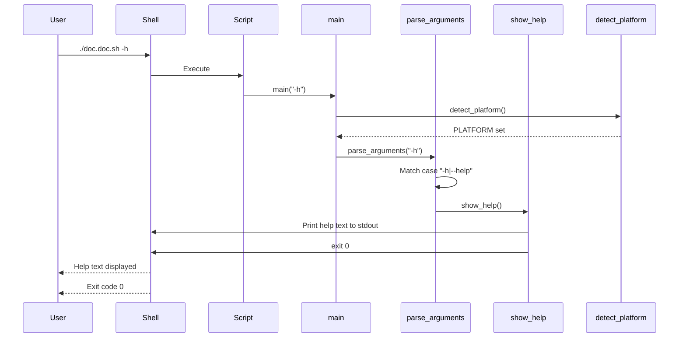
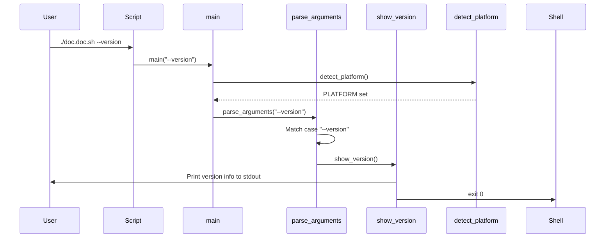
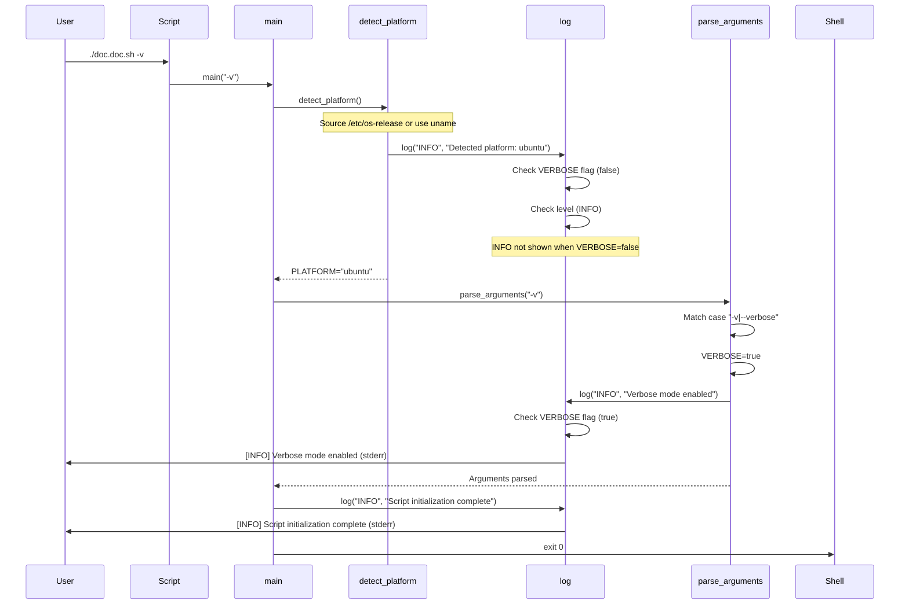
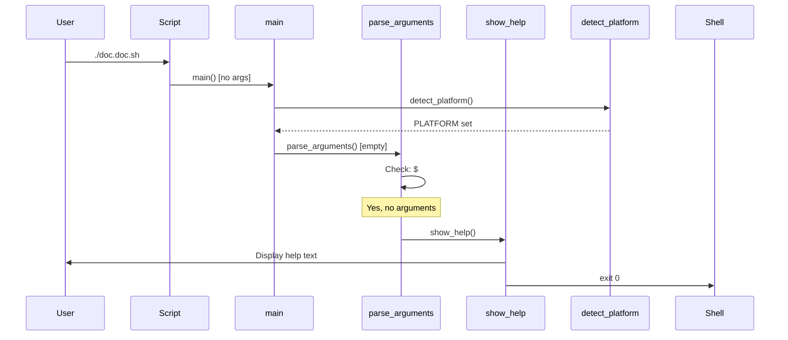
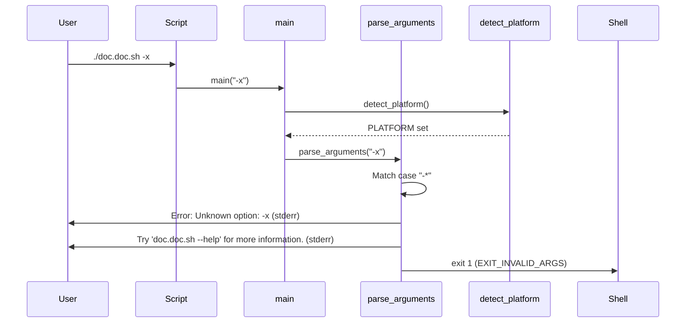
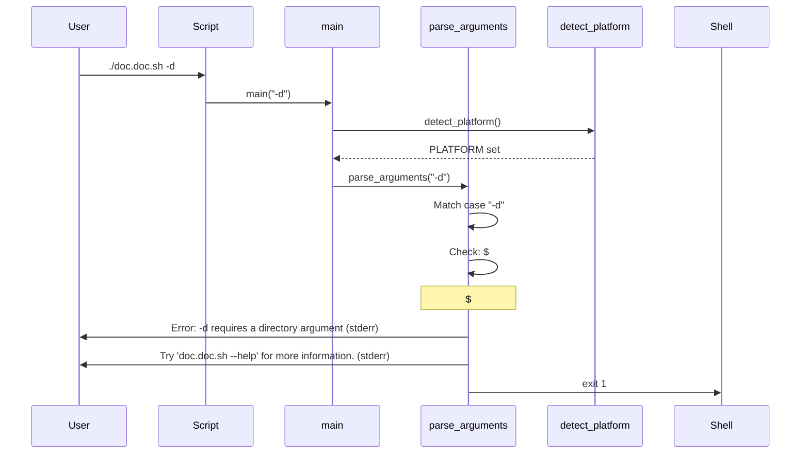
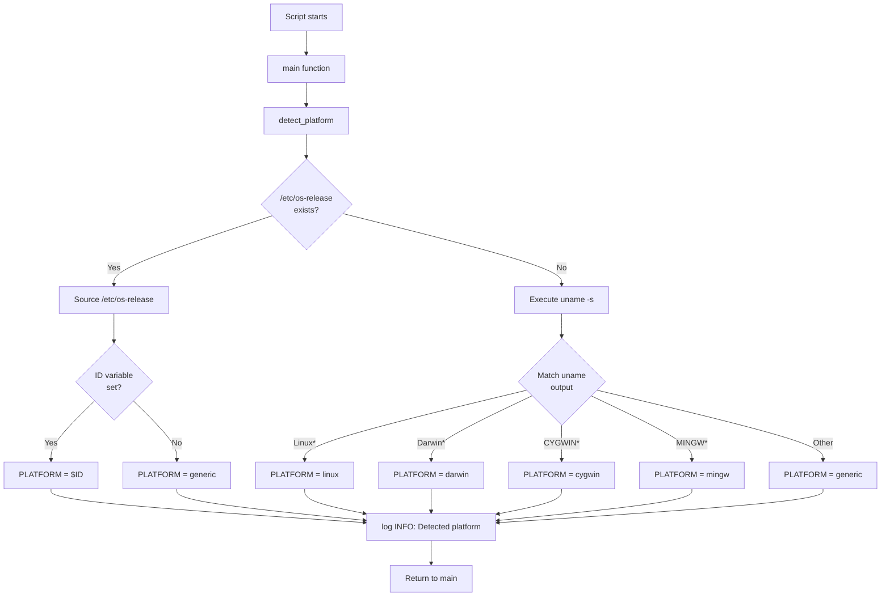
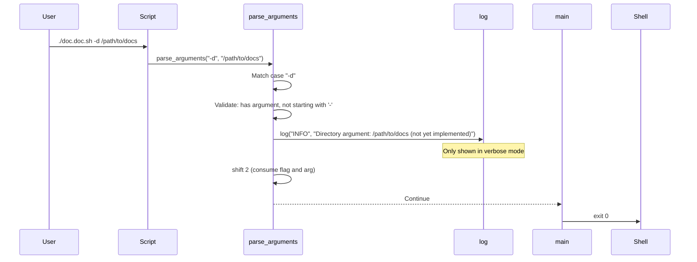

# Runtime View - Feature 0001: Basic Script Structure

**Implementation Date**: 2026-02-06  
**Feature ID**: feature_0001  
**Status**: Implemented  
**Vision Reference**: [Runtime View](../../../01_vision/03_architecture/06_runtime_view/06_runtime_view.md)

## Overview

This document describes the runtime behavior of the `doc.doc.sh` script for basic operations implemented in feature_0001. It focuses on the execution flows for help, version, verbose mode, and error handling scenarios.

## Runtime Scenario 1: Display Help

**Trigger**: User executes `./doc.doc.sh -h` or `./doc.doc.sh --help`

**Actors**: User, Script

**Preconditions**: Script is executable

**Execution Flow**:



**Output Example**:
```
doc.doc.sh - Documentation Documentation Tool

Usage:
  doc.doc.sh [OPTIONS]

Description:
  A lightweight Bash utility for analyzing documentation...

Options:
  -h, --help              Display this help message and exit
  -v, --verbose           Enable verbose logging output
  --version               Display version information and exit
  ...

Exit Codes:
  0  Success
  1  Invalid command-line arguments
  ...
```

**Postconditions**:
- Help text displayed to stdout
- Script exits with code 0
- No side effects (no files created, no state changed)

**Performance**: < 100ms (instant display)

---

## Runtime Scenario 2: Display Version

**Trigger**: User executes `./doc.doc.sh --version`

**Execution Flow**:



**Output Example**:
```
doc.doc.sh version 1.0.0
Copyright (c) 2026 doc.doc.md Project
GPL-3.0

This is free software: you are free to change and redistribute it.
There is NO WARRANTY, to the extent permitted by law.
```

**Postconditions**:
- Version information displayed
- Script exits with code 0

---

## Runtime Scenario 3: Verbose Mode Execution

**Trigger**: User executes `./doc.doc.sh -v`

**Execution Flow**:



**Output Example** (stderr):
```
[INFO] Verbose mode enabled
[INFO] Script initialization complete
```

**Postconditions**:
- VERBOSE global variable set to true
- Verbose messages displayed to stderr
- Script exits with code 0

**Key Behavior**: Platform detection message suppressed until verbose mode activated (timing issue in current flow, acceptable for basic implementation)

---

## Runtime Scenario 4: No Arguments

**Trigger**: User executes `./doc.doc.sh` (no arguments)

**Design Decision**: Show help instead of error for user-friendliness

**Execution Flow**:



**Rationale**: Improves discoverability - new users immediately see available options

**Alternative**: Could exit with error (requires -d/-m/-t/-w), deferred to future feature when those flags are functional

---

## Runtime Scenario 5: Invalid Option

**Trigger**: User executes `./doc.doc.sh -x` (unknown option)

**Execution Flow**:



**Output Example** (stderr):
```
Error: Unknown option: -x
Try 'doc.doc.sh --help' for more information.
```

**Exit Code**: 1 (EXIT_INVALID_ARGS)

**Postconditions**:
- Error message displayed to stderr
- User guided to help system
- Script exits with non-zero code

---

## Runtime Scenario 6: Missing Required Argument

**Trigger**: User executes `./doc.doc.sh -d` (flag without parameter)

**Execution Flow**:



**Output Example** (stderr):
```
Error: -d requires a directory argument
Try 'doc.doc.sh --help' for more information.
```

**Validation**: Checks both argument count and next argument pattern (prevents `-d -v` being accepted)

---

## Runtime Scenario 7: Platform Detection

**Trigger**: Script initialization (every execution)

**Execution Flow**:



**Example Platform Values**:
- Ubuntu: `PLATFORM="ubuntu"`
- Debian: `PLATFORM="debian"`
- macOS: `PLATFORM="darwin"`
- Windows Subsystem for Linux: `PLATFORM="ubuntu"` (or distro-specific)
- Git Bash on Windows: `PLATFORM="mingw"`
- Generic/Unknown: `PLATFORM="generic"`

**Fallback Strategy**: Robust three-tier detection ensures platform identification even on minimal systems

---

## Runtime Scenario 8: Prepared Flag (Future Implementation)

**Trigger**: User executes `./doc.doc.sh -d /path/to/docs`

**Current Behavior** (Framework phase):



**Output** (verbose mode, stderr):
```
[INFO] Directory argument: /path/to/docs (not yet implemented)
[INFO] Script initialization complete
```

**Design**: Accepts argument structure without implementation, preparing for future feature integration

---

## Cross-Cutting Runtime Concerns

### Logging Behavior

**Conditional Display Logic**:
```
Display message IF:
  (VERBOSE == true) OR
  (level == "ERROR") OR
  (level == "WARN")
```

**Levels by Visibility**:
- **Always shown**: ERROR, WARN
- **Verbose only**: INFO, DEBUG

**Output Stream**: All logs → stderr (separates diagnostics from data)

### Exit Code Strategy

**Immediate Exits** (before full initialization):
- Help display: exit 0
- Version display: exit 0
- Invalid arguments: exit 1

**Success Path**: Script initialization completes → exit 0

**Error Handling**: Any error triggers appropriate exit code (1-5) via `error_exit()`

### State Management

**Global Variables**:
- `VERBOSE`: Boolean flag, modified by argument parser
- `PLATFORM`: String, set by platform detection
- Read-only constants: Script metadata, exit codes

**No Persistent State**: Feature 0001 creates no files, no workspace interaction

### Performance Characteristics

**Execution Time**:
- Help/Version: < 100ms
- Platform detection: < 50ms
- Argument parsing: O(n) where n = argument count
- Overall initialization: < 200ms

**Resource Usage**:
- Memory: Minimal (shell process + variables)
- Disk I/O: Read /etc/os-release if present (negligible)
- Network: None

---

## Error Handling Runtime Behavior

### Error Exit Pattern

**Function**: `error_exit(message, exit_code)`

**Execution**:
1. Log message at ERROR level (always displayed to stderr)
2. Exit script with specified code

**Example Usage** (prepared for future features):
```bash
error_exit "Cannot read directory: $DIR" "${EXIT_FILE_ERROR}"
```

**Current Usage**: Framework defined, not actively used in feature_0001 (argument parsing does inline error handling)

---

## Testing Runtime Scenarios

### Executable Test Cases

1. **Help Display**: `./doc.doc.sh -h` → Check output, verify exit 0
2. **Version Display**: `./doc.doc.sh --version` → Check output, verify exit 0
3. **Verbose Mode**: `./doc.doc.sh -v` → Check stderr messages
4. **No Arguments**: `./doc.doc.sh` → Verify help shown, exit 0
5. **Unknown Option**: `./doc.doc.sh -x` → Verify error, exit 1
6. **Missing Argument**: `./doc.doc.sh -d` → Verify error, exit 1
7. **Valid Argument**: `./doc.doc.sh -v -d /tmp` → Verify accepted

### Platform Detection Test

**Test on Different Systems**:
- Ubuntu: PLATFORM should be "ubuntu"
- macOS: PLATFORM should be "darwin"
- System without os-release: PLATFORM should use uname fallback

**Manual Test**:
```bash
./doc.doc.sh -v 2>&1 | grep "Detected platform"
```

---

## Future Runtime Extensions

When subsequent features are implemented, the runtime will expand to include:

1. **Plugin Discovery**: Scanning plugin directories
2. **File Scanning**: Recursive directory traversal
3. **Plugin Execution**: Orchestrated tool invocation
4. **Workspace Management**: JSON file I/O
5. **Report Generation**: Template rendering

The current runtime provides the foundation (initialization, logging, error handling) upon which these behaviors will be built.

---

## Alignment with Vision

**Compliant Runtime Behaviors**:
- ✅ POSIX argument parsing (Vision §8.0003)
- ✅ Help text discoverability
- ✅ Exit code conventions
- ✅ Logging to stderr
- ✅ Platform detection for future platform-specific features

**Deferred Vision Elements** (awaiting future features):
- File scanning runtime
- Plugin orchestration flow
- Workspace locking and state management
- Report generation sequence

The implemented runtime provides the core execution framework while maintaining architectural consistency with the vision for future expansion.
