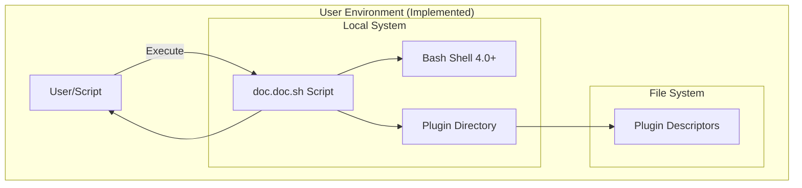

# 7. Deployment View (Implementation)

**Status**: Active  
**Last Updated**: 2026-02-08  
**Vision Reference**: [Deployment View](../../../01_vision/03_architecture/07_deployment_view/07_deployment_view.md)

## Overview

This document describes how the doc.doc toolkit is currently deployed and the deployment scenarios it supports in its present state.

## 7.1 Current Infrastructure Overview

The doc.doc toolkit operates as a **local command-line script** with zero server infrastructure requirements.



**Current Deployment Components**:
- ✅ `doc.doc.sh` - Main executable script
- ✅ `plugins/` - Plugin directory structure
- ✅ Plugin descriptors (`descriptor.json` files)
- ⏳ `template.doc.doc.md` - Template file (planned)
- ⏳ Workspace directory (planned)
- ⏳ Reports directory (planned)

## 7.2 Supported Deployment Scenarios

### Scenario 1: Development/Testing Environment ✅ SUPPORTED

**Environment**: Developer workstation for development and testing

**Deployment**:
```bash
# Clone repository
git clone https://github.com/user/doc.doc.git
cd doc.doc

# Make executable
chmod +x scripts/doc.doc.sh

# Test basic functionality
./scripts/doc.doc.sh --help
./scripts/doc.doc.sh -p list
./scripts/doc.doc.sh --version
```

**Current Capabilities**:
- ✅ Display help documentation
- ✅ List available plugins
- ✅ Show version information
- ✅ Test plugin discovery
- ⏳ File analysis (not yet implemented)

**Characteristics**:
- Interactive usage
- Immediate feedback
- Easy testing of plugins
- Verbose mode for debugging

---

### Scenario 2: Personal Desktop ✅ SUPPORTED (Limited)

**Environment**: Single-user Linux desktop or laptop

**Deployment**:
```bash
# Clone to user directory
cd ~/tools
git clone https://github.com/user/doc.doc.git
chmod +x doc.doc/scripts/doc.doc.sh

# Optional: Add to PATH
echo 'export PATH="$HOME/tools/doc.doc/scripts:$PATH"' >> ~/.bashrc
source ~/.bashrc

# Test
doc.doc.sh --help
doc.doc.sh -p list
```

**Current Capabilities**:
- ✅ Discover available plugins
- ✅ Check tool availability
- ⏳ Analyze documents (pending)

**Characteristics**:
- User-space installation (no root required)
- PATH integration possible
- Currently informational only

---

### Scenario 3: NAS Device ⏳ PREPARED (Not Functional)

**Environment**: Synology, QNAP, or similar NAS running Linux

**Deployment Status**: Infrastructure ready, analysis features pending

**Planned Deployment**:
```bash
# SSH into NAS
ssh admin@nas.local

# Install to shared volume
cd /volume1/scripts
git clone https://github.com/user/doc.doc.git
chmod +x doc.doc/scripts/doc.doc.sh

# Create directories (for future use)
mkdir -p /volume1/workspace
mkdir -p /volume1/reports

# Test current functionality
./doc.doc/scripts/doc.doc.sh -p list
```

**Current Limitations**:
- ⏳ Cannot analyze files yet
- ⏳ Cannot generate reports
- ⏳ Cron job integration not useful until analysis works

**Future Capabilities**:
- Scheduled analysis of shared documents
- Incremental processing
- Automated report generation

---

### Scenario 4: CI/CD Pipeline ⏳ PREPARED (Limited)

**Environment**: GitHub Actions, GitLab CI, Jenkins

**Current Capabilities**:
```yaml
# GitHub Actions example (working now)
name: Plugin Validation

on: [push]

jobs:
  validate:
    runs-on: ubuntu-latest
    steps:
      - uses: actions/checkout@v3
      
      - name: Check script syntax
        run: bash -n scripts/doc.doc.sh
      
      - name: Test help
        run: ./scripts/doc.doc.sh --help
      
      - name: List plugins
        run: ./scripts/doc.doc.sh -p list
```

**Ready for CI/CD**:
- ✅ Exit code 0 for success
- ✅ Exit code 1 for errors
- ✅ Stderr for logs/errors
- ✅ Stdout for data
- ⏳ Actual analysis (pending)

---

### Scenario 5: Shared Server ⏳ PREPARED (Not Functional)

**Environment**: Multi-user Linux server

**Deployment Status**: Installation pattern defined, full functionality pending

**Planned Deployment**:
```bash
# System administrator installs globally
sudo -i
cd /opt
git clone https://github.com/user/doc.doc.git
chmod +x /opt/doc.doc/scripts/doc.doc.sh
ln -s /opt/doc.doc/scripts/doc.doc.sh /usr/local/bin/doc.doc
chmod 755 /usr/local/bin/doc.doc

# Users can now run
doc.doc --help
doc.doc -p list
```

**Current State**:
- ✅ Can be installed system-wide
- ✅ Users can discover plugins
- ⏳ Cannot perform analysis yet

---

## 7.3 Directory Structure (Implemented)

**Current Installation Layout**:
```
doc.doc/                          # Project root
├── scripts/
│   ├── doc.doc.sh                # ✅ Main script (executable)
│   ├── template.doc.doc.md       # ⏳ Default template (planned)
│   └── plugins/                  # ✅ Plugin directory
│       ├── all/                  # ✅ Cross-platform plugins
│       │   └── stat/             # ✅ Example plugin
│       │       └── descriptor.json  # ✅ Plugin descriptor
│       └── ubuntu/               # ✅ Platform-specific plugins
│           └── apt-cache/        # ✅ Example Ubuntu plugin
│               └── descriptor.json
├── tests/                        # ✅ Test suite
│   ├── unit/                     # ✅ Unit tests
│   ├── integration/              # ⏳ Integration tests
│   └── system/                   # ⏳ System tests
├── 01_vision/                    # ✅ Architecture vision
├── 02_agile_board/               # ✅ Development workflow
├── 03_documentation/             # ✅ Implementation docs
├── README.md                     # ✅ Project documentation
└── LICENSE                       # ✅ License file
```

**Runtime Structure** (planned, not yet created):
```
# User workspace (to be created by script in future)
~/.doc.doc/
├── workspace/                    # ⏳ Analysis state (planned)
│   └── *.json                    # ⏳ Per-file metadata
└── logs/                         # ⏳ Optional logs (planned)
```

## 7.4 Platform-Specific Considerations

### Ubuntu/Debian ✅ PRIMARY PLATFORM

**Status**: Fully supported for current features

**Requirements**:
- Bash 4.0 or later ✅
- GNU Coreutils ✅
- Optional: jq or python3 (for plugin listing)

**Verification**:
```bash
# Test on Ubuntu 20.04+
bash --version  # Should show 4.0+
./scripts/doc.doc.sh -p list  # Should work
```

---

### Generic Linux ✅ FALLBACK SUPPORT

**Status**: Should work via "generic" platform detection

**Platform Detection**:
- Falls back to "generic" if not Ubuntu/Debian
- Uses `plugins/all/` directory only
- No platform-specific plugins loaded

**Compatibility**:
- ✅ Help, version, plugin listing should work
- ⏳ Full analysis depends on available tools

---

### macOS ⏳ UNTESTED

**Status**: Should work but not tested

**Considerations**:
- BSD vs GNU coreutils differences
- `stat` command flag differences
- Platform detection via `uname -s` → "darwin"

**Required Testing**:
- Platform detection correctness
- Plugin discovery functionality
- Future: Tool command differences

---

### WSL (Windows Subsystem for Linux) ⏳ UNTESTED

**Status**: Should work (Linux environment)

**Expected Behavior**:
- Platform detection sees as Linux
- Should behave like Ubuntu if WSL Ubuntu
- Path handling should work (Unix paths)

---

## 7.5 Installation Methods (Current)

### Method 1: Git Clone ✅ SUPPORTED

```bash
git clone https://github.com/user/doc.doc.git
cd doc.doc
chmod +x scripts/doc.doc.sh
./scripts/doc.doc.sh --help
```

**Advantages**:
- ✅ Always latest code
- ✅ Easy updates (git pull)
- ✅ Full repository access

**Disadvantages**:
- Requires git installed
- Includes dev files (tests, docs)

---

### Method 2: Direct Download ✅ POSSIBLE

```bash
wget https://github.com/user/doc.doc/archive/refs/heads/main.zip
unzip main.zip
cd doc.doc-main
chmod +x scripts/doc.doc.sh
./scripts/doc.doc.sh --help
```

**Advantages**:
- No git required
- Simpler for non-developers

**Disadvantages**:
- Manual updates required
- Still includes full repository

---

### Method 3: Package Manager ⏳ FUTURE

**Planned** (not implemented):
- `apt install doc.doc` (Debian/Ubuntu)
- `brew install doc.doc` (macOS)
- `yay -S doc.doc` (Arch AUR)

**Benefits**:
- Automatic updates
- System-wide installation
- Dependency management

---

## 7.6 Resource Requirements (Current)

### Minimum Requirements ✅ VERIFIED

- **CPU**: Any (shell script, negligible CPU)
- **RAM**: <10 MB for core script
- **Disk**: <5 MB (script + plugins)
- **OS**: Linux/Unix with Bash 4.0+

### Optional Dependencies

- **jq**: For optimal JSON parsing (graceful fallback to python3)
- **python3**: JSON parsing fallback if jq unavailable

### Future Requirements (Analysis Features)

- **Disk**: Additional for workspace (1-10 MB per 1000 files analyzed)
- **Disk**: Additional for reports (varies by template)
- **Tools**: stat, file, find (standard on most systems)

---

## 7.7 Deployment Checklist

### For Current Version (Basic Functionality) ✅

- [ ] Clone/download repository
- [ ] Make script executable (`chmod +x`)
- [ ] Test help display (`--help`)
- [ ] Test version display (`--version`)
- [ ] Test plugin listing (`-p list`)
- [ ] Verify platform detection (verbose mode)
- [ ] Optional: Install jq for better JSON parsing

### For Future Full Deployment ⏳

- [ ] Create workspace directory
- [ ] Create reports directory
- [ ] Customize template (optional)
- [ ] Add custom plugins (optional)
- [ ] Configure cron job (if automated)
- [ ] Test incremental analysis
- [ ] Verify report generation

---

## 7.8 Update and Maintenance

### Current Update Process ✅

```bash
cd doc.doc
git pull origin main
chmod +x scripts/doc.doc.sh  # May not be needed
./scripts/doc.doc.sh --version  # Verify update
```

### Maintenance Status

- **Script**: Single file, easy to maintain
- **Plugins**: Add/remove descriptors as needed
- **Updates**: Via git pull (development)
- **Stability**: Core framework stable

---

## Summary

### Currently Deployable ✅

The doc.doc toolkit can be deployed in any environment with Bash 4.0+ for:
- Help documentation access
- Plugin discovery and validation
- Version information
- Testing and development

### Deployment Readiness by Scenario

| Scenario | Status | Current Use | Future Use |
|----------|--------|-------------|------------|
| Development | ✅ Full | Testing, development | Analysis, generation |
| Personal Desktop | ✅ Limited | Plugin discovery | File analysis |
| NAS Device | ⏳ Prepared | Not functional | Scheduled analysis |
| CI/CD Pipeline | ✅ Limited | Script validation | Doc generation |
| Shared Server | ⏳ Prepared | Not functional | Multi-user analysis |

### Next Deployment-Related Steps

1. Implement file analysis → Enable actual usage
2. Implement workspace → Enable state persistence
3. Implement reports → Enable output generation
4. Create installation guide → Simplify deployment
5. Package for distribution → Easier installation

The deployment infrastructure and patterns are established. Full deployment capabilities will be realized as core analysis features are implemented.
